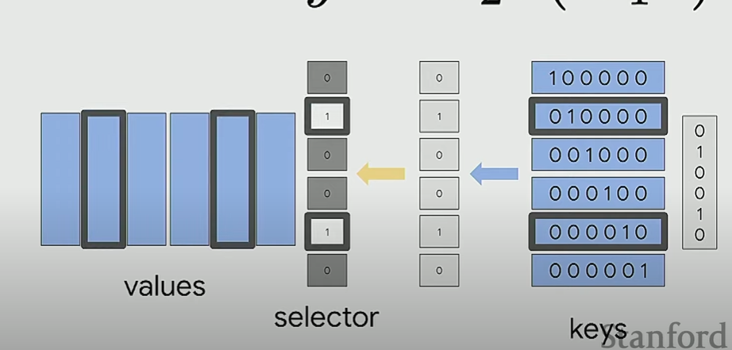

# CS224N NLP with deep learning
## Lecture 22 Building Knowledge Representations
### Knowledge editing
+ Transformer feed forward layers are key-value memories

+ Transformer tend to look up information on the last token of entity. 
### What is a good knowledge representation?
+ Information on the web can be incorrect or noisy
+ Fast and modular knowledge editing
+ Attribution and interpretability
+ Efficient scaling
### Memory-augmented model
+ How to retrieve memories
  + external: LamDA, WebGPT, learn to use search engine
  + internal memory: score a memory with a function
+ Training of neural memory retriever: maximize positive example probability, DPR, ORQA
+ How to use memories
  + text fusion