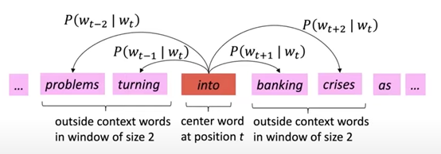

# CS224N NLP with deep learning
## Lecture 1 Introduction and Word Vectors
### Meanings of word
+ Denotational semantics: signifier and signified
+ Traditional methods: one-hot vectors. There is no similarity for such orthogonal vectors.
+ Distributional semantics: a word's meaning is given by the words that frequently appear close-by.
  + When a word $w$ appears in a text, its context is the set of words that appear nearby, which can be used to build up a representation of $w$
### Word vectors
+ We want a dense vector for each word such that it is similar to vectors that appear in similar contexts
### Word2vec
#### General idea
1. We have a corpus of text
2. Every wor in a fixed vocabulary is representeed by a vector
3. Go through each position $t$ in the text, with center word $c$ and context words $o$.
4. Use similarity of word vectors for $c$ and $o$ to calculate $P(o|c)$
5. Adjust the vectors to maximize $p$

#### Objective function
For each position $t=1 ... T$, predict context words within a window of size $m$ given a center word $w_j$. $\theta$ is the vector containing all parameters of the model. Maximize the predict accuracy:
$$
L(\theta) = \prod_{t=1}^T\prod_{-m \le j \le m, j \ne 0} P(w_{t+j}|w_t; \theta)
$$
Minimize the objective function: average negative log likelihood
$$
J(\theta) = -\dfrac{1}{T}\log L(\theta) = -\dfrac{1}{T} \sum_{t=1}^T\sum_{-m \le j \le m, j \ne 0} \log P(w_{t+j}|w_t; \theta)
$$ 
#### Softmax function
For each word, we use two vectors, $v_w$ when $w$ is a center word, $u_w$ when $w$ is a context word
$$
P(o|c) = \dfrac{\exp(u_o^Tv_c)}{\sum\limits_{w\in V} \exp(u_w^Tv_c)}
$$
$u_o^Tv_c$ is the dot product that measures similarity. $\exp$ makes everything positive, then normalize over the entire vocabulary. This is a softmax function that maps a real number $x_i$ to a probability distribution $p_i$  
$$
softmax(x_i) = \dfrac{\exp (x_i)}{\sum\limits_{j=1}^n\exp(x_j)} = p_i
$$
#### Optimization
Gradient descent for a $\theta$ that is $2dV$ long with $d$ dimensional vectors and $V$ words of vocabulary. 
$$
\dfrac{\partial}{\partial v_c} \log \dfrac{\exp(u_o^Tv_c)}{\sum\limits_{w\in V} \exp(u_w^Tv_c)} \\
=\dfrac{\partial}{\partial v_c} \log \exp(u_o^Tv_c) -\dfrac{\partial}{\partial v_c} \log\sum\limits_{w\in V} \exp(u_w^Tv_c) \\
= \dfrac{\partial}{\partial v_c} u_o^Tv_c - \dfrac{1}{\sum\limits_{w\in V} \exp(u_w^Tv_c)}\dfrac{\partial}{\partial v_c} \sum\limits_{x=1}^V \exp(u_x^Tv_c)\\
= u_o-  \dfrac{1}{\sum\limits_{w\in V} \exp(u_w^Tv_c)} \sum\limits_{x=1}^V\exp(u_x^Tv_c)u_x \\ 
=u_o - \sum\limits_{x=1}^V P(x|c)u_x
$$  
Notice that $\dfrac{1}{\sum\limits_{w\in V} \exp(u_w^Tv_c)} \sum\limits_{x=1}^V\exp(u_x^Tv_c) = \sum\limits_{x=1}^V\dfrac{\exp(u_x^Tv_c)}{\sum\limits_{w\in V} \exp(u_w^Tv_c)} = \sum\limits_{x=1}^VP(x|c)$, the original softmax function. $u_o$ is the actual vector, and $\sum\limits_{x=1}^V P(x|c)u_x$ is the expectation of the vector. 