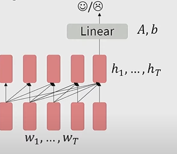

# CS224N NLP with deep learning
## Lecture 10 Transformers and pretraining
### Word structure and subword models
Finite vocabulary assumption makes little sense in languages with complex morphology  
Subword modelling refers to methods that look at structures below the word level. At training and testing, each word is split into a sequence of unknown subwords
#### The byte-pair encoding
1. Start with only characters and 'end of word' symbol
2. Use a corpus to find frequent adjacent characters as subwords
3. Replace characters with the new subword, repeat until reach desired vocab size. 
### Model pretraining and word embeddings
Nowadays, almost all parameters in NN are initialized using pretraining.   
Pretrain models hide parts of the input from the model and try to reconstruct it.  
This is effective at building strong: representations of language, parameter initializations, probability distributions. 
#### Pre training and fine tuning 
$\hat{\theta}$ by approximating loss of pretraining $\min\limits_\theta L_{pretrain}(\theta)$  
Fine tune $\min\limits_\theta L_{finetune}(\theta)$, starting with $\hat{\theta}$  
In practice, the gradient seems stays close to $\hat{\theta}$
#### Pre training decoders
Fine tune the language model by training a classifier on top of the hidden state of the last word. Gradients backpropagate through the whole network.   

#### Generative pretrain transformer (GPT)
#### Pretraining encoders
Replace some of the words in the input with [MASK] token and predict these words. 
#### Bidirectional Encoder Representation from transformers (BERT)
The input is two separate texts. The model should predict if the second text follows the first one. 
#### Pretaining encoder-decoder
Replace spans in the input with placeholders and decode these. 