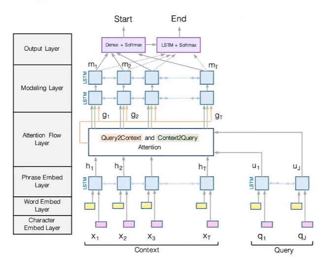
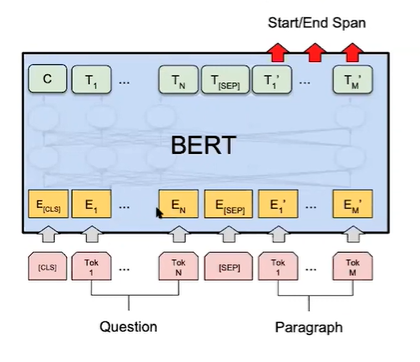

# CS224N NLP with deep learning
## Lecture 11 Question answering'
### Reading Comprehension
#### Stanford question answering dataset(SQuAD)
100k annotated triples  
Evaluation: exact match and F1 score  
### Neural models for reading comprehension
Input: $C = (c_1,...,c_n) Q = (q_1,...,q_m)$  
Output: $start, end$ answer is a span from the passage. 
#### BiDAF the Bidirectional Attention Flow Model

#### BiDAF encoding
A concatenation of word embeddings (GloVe) and character embedding (CNN + max pooling). Then, use two bidirectional LSTMs separately to produce contextual embeddings for both passage and question. 
#### BiDAF attention
Context to query attention: For each word in context, find the most relevant words from query.   
Query to context attention: Choose the context words that are most relevant to one of the query words   
First, compute a similarity score for every pair of context and query word.   
$$
S_{i,j} = \bold{w}^T[c_i;q_j;c_i\odot q_j]
$$  
c2q attention:
$$
\alpha_{i,j} = softmax_j(S_i,j), \bold{a}_i=\sum_{j=1}^M\alpha_{i,j}q_j
$$
q2c attention: 
$$
\beta_i = softmax_i(\max_{j=1}^M(S_{i,j})),\bold{b}_i = \sum_{i=1}^N\beta_i c_i
$$
Final output: 
$$
g_i = [c_i;a_i;c_i\odot a_i;c_i\odot b_i]
$$
#### BiDAF output
Pass $g_i$ to another two layers of bidirectional LSTMs and two classifiers to predict start and end positions   
Final loss:
$$
L = -\log p_{start}(s*) - \log_{end}(e*)
$$
#### BERT for reading comprehension

#### Improve the pretraining objectives-spanBERT
### Is reading comprehension solved?
Add random sentence dramatically reduce performance.   
Models can hardly generalize to other datasets. 
### Open domain QA
#### Retriever-reader framework 
We can also use BERT to train the retriever