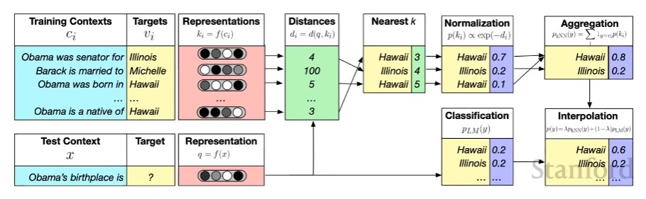
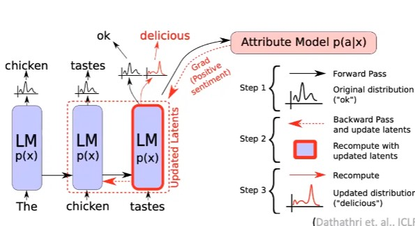

# CS224N NLP with deep learning
## Lecture 12 Natural Langauge Generation
### Basics of NLG
In an autoregresser model, at each time step $t$, the model takes in a sequence of inputs and outputs a new token.  
At each time step, compute a vector of scores for each token in the vocab.  
$$
S = f(\{y_{<t}\},\theta)
$$
Then compute a probability distribution using these scores.  
$$
P(y_t|\{y_{<t}\})= \dfrac{\exp(S_w)}{\sum_{w'\in V}\exp(S_{w;})}
$$
At inference time, the decoding algorithm defines a function to select a token from the vocab. 
$$
\hat{y_t} = g(P(y_t|\{y_{<t}\}))
$$ 
Train the model to minimize the negative likelihood of predicting the next word. 
$$
L_t = -\log P(y_t^*|\{y^*_{<t}\})
$$  
And sum over the whole sequence
$$
L = -\sum\limits_{t=1}^T\log P(y_t^*|\{y^*_{<t}\})
$$
### Decoding
Greedy search, beam search cause repitition problem  
#### sampling
top $k$ sampling, top $p$ sampling
#### Temperature scaling
Apply a hyperparameter $\tau$ to softmax:
$$
P(y_t = w)= \dfrac{\exp(\frac{S_w}{\tau})}{\sum_{w'\in V}\exp(\frac{S_{w'}}{\tau})}
$$  
$\tau$ > 1, more diverse outputs
#### Re-balancing distribution
Using a database of n-grams from the training corpus, search for similar phrase in decoding. 

Define a model that evaluates the behavior, and backpropagate gradients to the langauge model. 

#### Re-ranking
Generate a bunch of sequences and rank them with a score, perplexity, style, discourse,...
### training
#### Unlikelihood training
Given a set of undesired tokens $C$, lower their likelihood:  
$$
L^t = -\sum\limits_{y_{neg}\in C} \log(1-P(y_{neg}|\{y^*\}_{<t}))
$$
Combine this with the negative likelihood loss. 
#### Exposure bias 
Training uses gold sequence but inference uses machine generated text.  
Solution: Scheduled sampling, dataset aggregation, sequence re-writing: learn to retrieve a human-written sequence and edit it
#### reinforcement learning 
$$
L = -\sum\limits_{t=1}^T r(\hat{y_t})\log P(\hat{y_t}|\{y^*\};\{y^*\}_{<t})
$$
The reward function is determined by the task. 
### Evaluation
#### Content overlap metrics
Compute a similarity score between generated sequence and gold standard text.   
N-gram overlap: BLEU, ROUGE...   
Semantic overlap: PYRAMID, SPICE, ...
#### Model-based metrics
Use learned representations of words and sentences to compute semantic similarity.   
Word distance: vector similarity, word mover's distance, BERT score    
beyond word level: sentence mover similarity, BLEURT
#### Human evaluations
### Ethical considerations