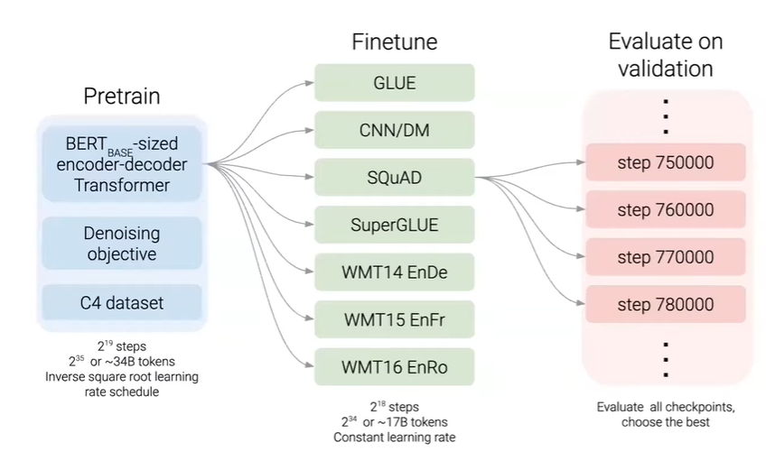

# CS224N NLP with deep learning
## Lecture 14 T5 and Large Language Models
### T5: Given the transfer learning landscape, which method works best?
treat every NLP task as text-to-text format. 
#### Training data
1. Common Crawl Web Extracted Text  
2. Text cleaning
3. C4 dataset
#### Training objective
Predict randomly missing words. 

#### Multilingual model
#### Knowledge in pre-training
