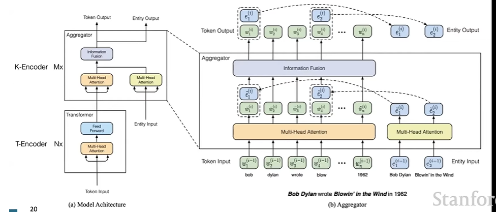
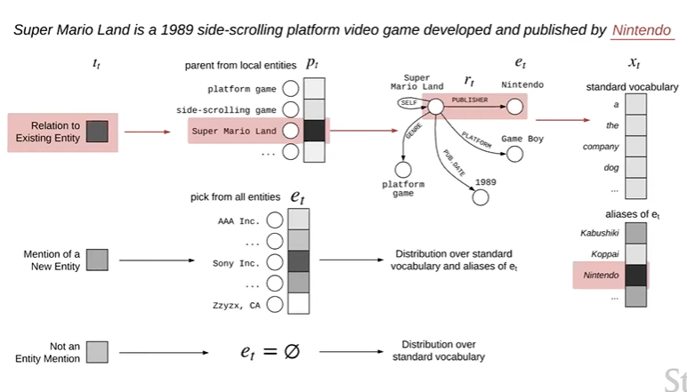
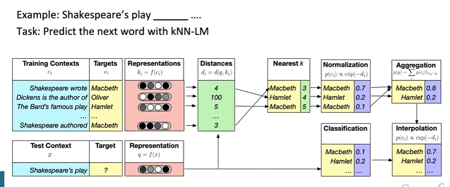
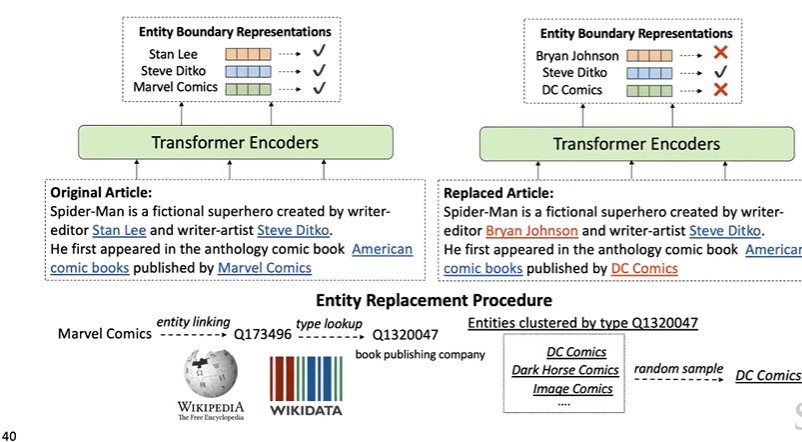

# CS224N NLP with deep learning
## Lecture 15 Add Knowledge to Language Models
### What does a LM generally know
Predictions generally make sense, but are factually incorrect. Because of:
+ unseen facts
+ rare facts
+ model sensitivity
### Advantage of LM over Knowledge Base 
### Pretrained embeddings
#### Entity linking
Link mentions in a text to an entity in a KM. 
#### Training entity embeddings
Knowledge graph embedding   
Word-entity co-occurrence    
Transformer encodings of entity description  
Add a fusion layer to combine context and entity in the same embedding space.  
$$
h_j = F(W_tw_j+W_ee_k+ b)
$$
where $w_j$ is the word embedding and $e_k$ is the entity embedding. 
#### ERNIE: Enhanced Language Representation with Informative Entities
Multilayer bidirectional Transformer encoder for encoding text + stacked blocks of multi-head attention and fusion layer for encoding knowledge

Pretrained with masked language model, next sentence prediction and Knowledge pretraining (mask token-entity alignments and predict corresponding entity for a token in the sequence)
$$
p(e_j|w_i) = \dfrac{\exp(Ww_i\cdot e)}{\sum\limits_{k=1}^mWw_i\cdot e_k}
$$
#### Joint learn to link entities with knowBERT
Key idea: pre-train an entity linker as an extension to BERT
### External memory
#### KGLM
Key idea: condition the language model on a knowledge graph  
Predict the next word using entity information:  
$$
P(x^{(t+1)},\epsilon^{(t+1)}|x^{(t)},...,x^{(1)},\epsilon^{(t)},...,\epsilon^{(1)})
$$
The LM needs to predict the type of the next word (new entity/related entity/not an entity)     
For a related entity:  
Find the top-scoring parent and relation in the local KG using the LSTM hidden state and pretrianed entity and relation embeddings:  
$$
P(p_t) = softmax (v_p\cdot h_t)
$$
where $p_t$ is the parent entity, $v_p$ is the corresponding entity embedding, and $h_t$ is from LSTM.  
For a new entity:  
Find the top-scoring parent and relation in the full KG  
For not an entity: LSTM prediction

#### Nearest Neighbor Language Models
Key idea: Learning similarities between text sequences is easier than predicting the next word  

### Modify training data
Mask the data to introduce additional training tasks that require factual knowledge
#### WKLM: Weakly-supervised knowledge-pretrained Language Model
Key idea: train the model to distinguish between true and false knowledge   

#### Learn inductive bias through masking
Encourage LM to learn factual knowledge by being clever about masking
### Evaluation
#### Language Model Analysis 
How much relational knowledge is already in LM?  
Generate cloze statements with KG triples. 