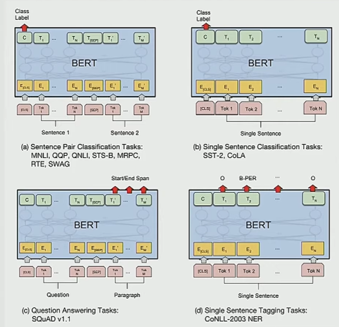

# CS224N NLP with deep learning
## Lecture 20 BERT and other pre-trained language models
### BERT
Predict masked words to create bidirectional representations   
Next sentence prediction for relations between sentences

### Improvements of BERT
1. RoBERTa: trained more epochs, on more data, improved masking and training data
2. XLNet: Relative position embeddings, permutation language modelling
3. ALBERT: Factorized embedding parameterization, cross-layer parameter sharing
4. T5: unified text-to-text transformer
5. ELECTRA: Train models to discriminate locally plausible text from real text. 
### Distill
1. Train teacher for maximum accuracy
2. Label data with teacher
3. Train student, a much smaller model
