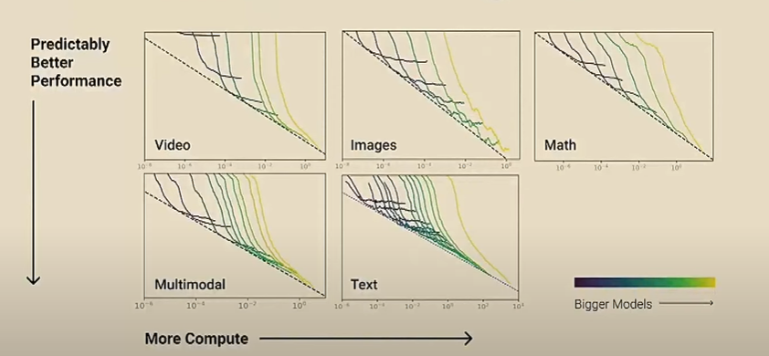

# CS224N NLP with deep learning
## Lecture 23 Scaling Language Models
### Magnitude for LMs
300 B tokens on a 1T parameter model: 1e24 FLOPS
### Scaling Laws
Performance is about avoiding bottlenecks: not enough data/parameters, bad information propagation...
### Multimodality

Optimal modal size is nearly universal. 