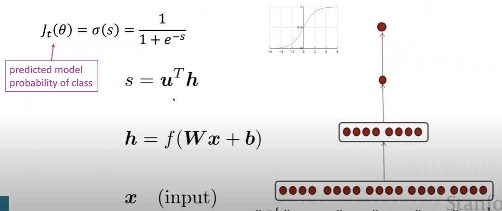
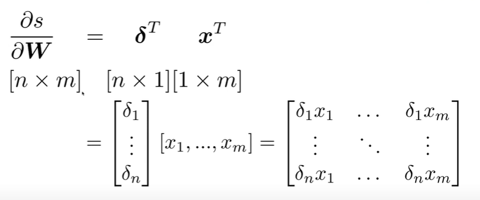
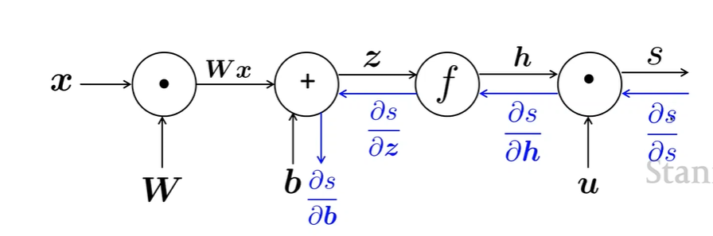

# CS224N NLP with deep learning
## Lecture 2 Backprop and Neural Networks
### Named Entity Recognition
#### Simple NER: Window classification using binary logistic classification
Idea: Train logistic classifier on labeled data to classify center word for each class based on a series of word vectors in a window.
$$
\mathbf{input:} \boldsymbol{x} \\
\mathbf{hidden:} \boldsymbol{h} = f(\boldsymbol{Wx} +\boldsymbol{b}) \\
s = \boldsymbol{u}^T \boldsymbol{h} \\ 
J_t(\theta) = \sigma(s) = \dfrac{1}{1 + e^{-s}}
$$

#### Stochastic gradient descent
$$
\theta^{new} = \theta^{old} - \alpha\nabla_\theta J(\theta)
$$
### Matrix calculus
#### Gradient
Given $f(\boldsymbol{x}) = f(x_1,x_2,x_3,...,x_n)$  
Its gradient is the vector : 
$$
\dfrac{\partial f}{\partial \boldsymbol{x}} = \left[\dfrac{\partial f}{\partial x_1},\dfrac{\partial f}{\partial x_2},\dfrac{\partial f}{\partial x_3},...,\dfrac{\partial f}{\partial x_n}\right]
$$
Given $\boldsymbol{f}(\boldsymbol{x}) = \left[f_1(x_1,x_2,...,x_n),...,f_m(x_1,x_2,...,x_n) \right]$
Its Jacobian Matrix is a $m\times n$ matrix:
$$
\dfrac{\partial \boldsymbol{f}}{\partial \boldsymbol{x}} = \begin{bmatrix}
    \dfrac{\partial f_1}{\partial x_1} & \cdots & \dfrac{\partial f_1}{\partial x_n} \\
    \vdots  & \ddots & \vdots \\ 
    \dfrac{\partial f_m}{\partial x_1} & \cdots & \dfrac{\partial f_m}{\partial x_n} \\
\end{bmatrix} \\
(\dfrac{\partial \boldsymbol{f}}{\partial \boldsymbol{x}})_{ij} = \dfrac{\partial f_i}{\partial x_j} 
$$
#### Chain rule
$$
\boldsymbol{h} = f(\boldsymbol{z}) \\
\boldsymbol{z} = \boldsymbol{Wx} + \boldsymbol{b} \\
\dfrac{\partial \boldsymbol{h}}{\partial \boldsymbol{x}} = \dfrac{\partial \boldsymbol{h}}{\partial \boldsymbol{z}}\dfrac{\partial \boldsymbol{z}}{\partial \boldsymbol{x}}
$$
#### Elementwise nonlinearity
$$
\boldsymbol{h} = f(\boldsymbol{z})\\
(\dfrac{\partial \boldsymbol{h}}{\partial \boldsymbol{z}})_{ij} = \dfrac{\partial h_i}{\partial z_j} = \dfrac{\partial}{\partial z_j}f(z_i) \\
=\begin{cases}f'(z_i) &\mathsf{if} i=j \\ 0 & \mathsf{otherwise}\end{cases} \\
\dfrac{\partial \boldsymbol{h}}{\partial \boldsymbol{z}} = \begin{pmatrix}f'(z_1) & & 0 \\ & \ddots& \\0 &  & f'(z_n) \end{pmatrix} = \mathsf{diag}(\boldsymbol{f'}(z))
$$
#### Other Jacobians
$$
\dfrac{\partial}{\partial \boldsymbol{x}}(\boldsymbol{Wx + b}) = \boldsymbol{W} \\
\dfrac{\partial}{\partial \boldsymbol{b}}(\boldsymbol{Wx + b}) = I \\
\dfrac{\partial}{\partial \boldsymbol{u}}(\boldsymbol{u}^T\boldsymbol{h}) = \boldsymbol{h}^T
$$
#### Neural net
$$
\dfrac{\partial s}{\partial \boldsymbol{b}} =\dfrac{\partial s}{\partial \boldsymbol{h}}\dfrac{\partial \boldsymbol{h}}{\partial \boldsymbol{z}}\dfrac{\partial \boldsymbol{z}}{\partial \boldsymbol{b}}  \\
=\boldsymbol{u}^T\mathsf{diag}(f'(\boldsymbol{z}))\boldsymbol{I} \\
= \boldsymbol{u}^T \circ f'(\boldsymbol{z})\\
\delta = \dfrac{\partial s}{\partial \boldsymbol{h}}\dfrac{\partial \boldsymbol{h}}{\partial \boldsymbol{z}}= \boldsymbol{u}^T \circ f'(\boldsymbol{z}) \\
\dfrac{\partial s}{\partial \boldsymbol{W}} =\dfrac{\partial s}{\partial \boldsymbol{h}}\dfrac{\partial \boldsymbol{h}}{\partial \boldsymbol{z}}\dfrac{\partial \boldsymbol{z}}{\partial \boldsymbol{W}}\\ 
= \delta \dfrac{\partial \boldsymbol{z}}{\partial \boldsymbol{W}} \\
= \boldsymbol{\delta}^T\boldsymbol{x}^T
$$
#### Output shape
Make the shape of the gradient the shape of parameters so that $\dfrac{\partial s}{\partial \boldsymbol{W}}$ is $m\times n$ 

There could be difference between the Jacobian shape (makes chain rule easy) and shape convention (makes SGD easy)
### Back propagation

#### Efficiency: avoid duplicated computation
