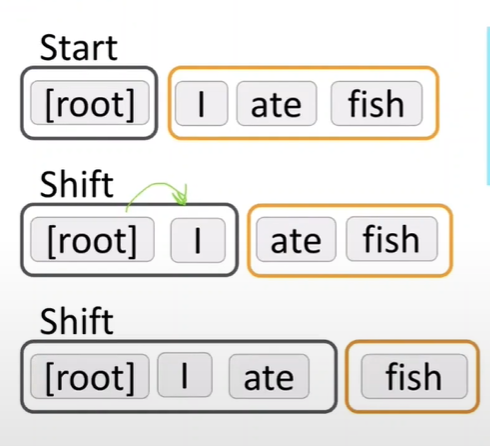
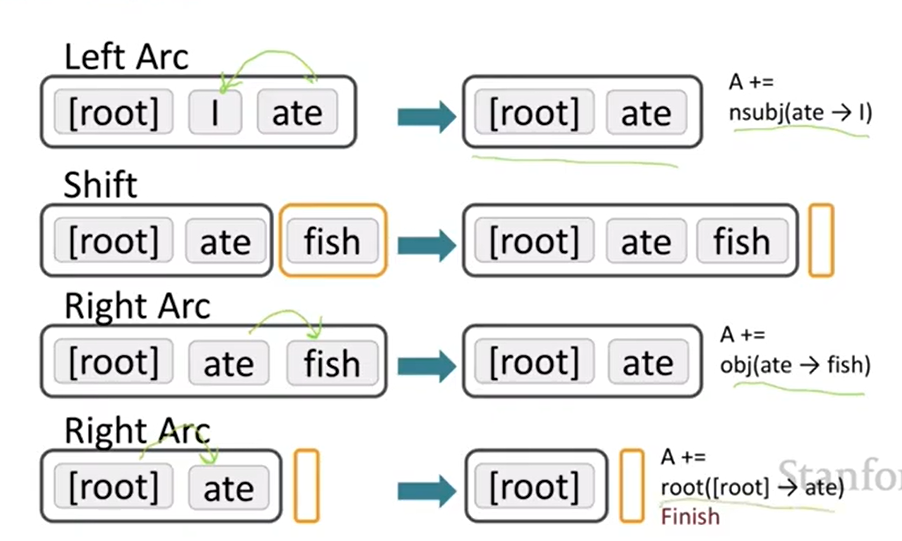

# CS224N NLP with deep learning
## Lecture 3 Dependency Grammar
### Views of linguistic structure:
+ Phrase structure organizes words into constituents - Context-free grammar
+ Dependency grammar: which words depend on which other words
  + PP is treated as a case marked noun
#### PP attachment ambiguity
#### Coordination scope ambiguity
#### adj/adv modifier ambiguity
#### VP attachment ambiguity
### Dependency grammar and dependency structure
+ Arrows can go both way, but here we use point them from head to dependent
+ A fake root node of the sentence
+ Annotated data and treebanks
+ Source of information:
  + bllexical affinities
  + dependency distances: most are nearby
  + intervening material: rarely span across verbs or punctuation
  + valency of heads: how many dependents for a head
+ Parsing
  + Choose for each word what other word it is a dependent of
  + Only one word is a dependent of root. 
  + no cycles
+ Projectivity: No crossing dependency arcs
### Methods of DP
1. dynamic programming $O(n^3)$
2. Graph algorithms: minimum spanning tree
3. Constraint satisfaction
4. Transition based parsing/deterministic dependency parsing: greedy choice of attachments based on ML classifier
### Transition based parsing
Start: $\sigma = [ROOT],\beta = w_1,...,w_n, A = \emptyset$  
Shift:
$$
\sigma w_i,| \beta, A \to \sigma |w_i,\beta, A
$$
Left arc: 
$$
\sigma | w_i|w_j,\beta, A \to \sigma |w_j,\beta, A\cup {r(w_j,w_i)}
$$
Right arc: 
$$
\sigma | w_i|w_j,\beta, A \to \sigma |w_i,\beta, A\cup {r(w_i,w_j)}
$$
Final: $\sigma = [w],\beta = \emptyset$

### Malt Parser
Each action is predicted by a discriminative classifier
#### Evaluation
Unlabeled accuracy score = $\dfrac{correct dep}{dep}$  
$labeled accuracy score 