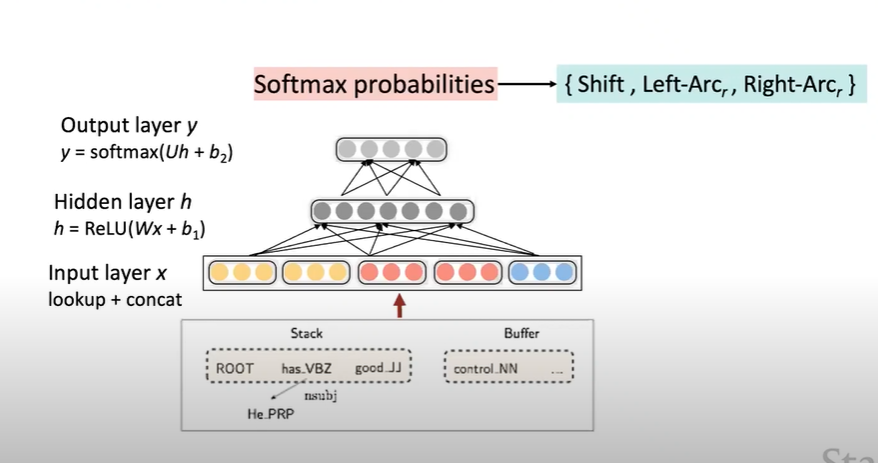
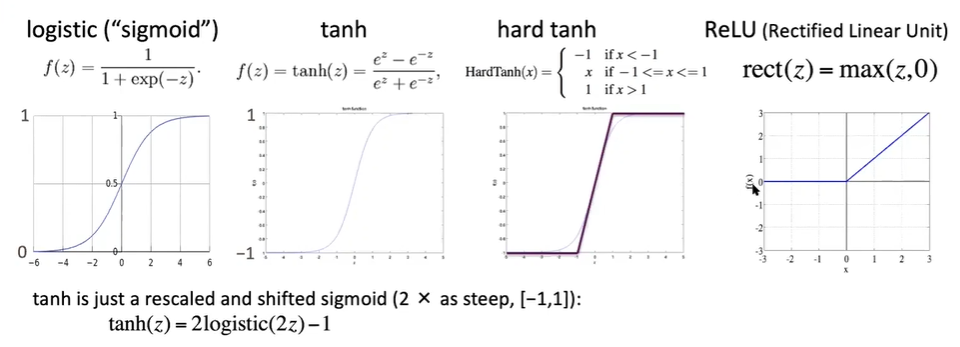
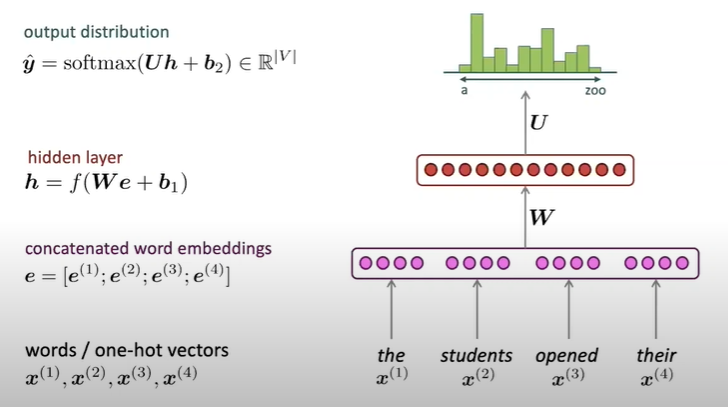
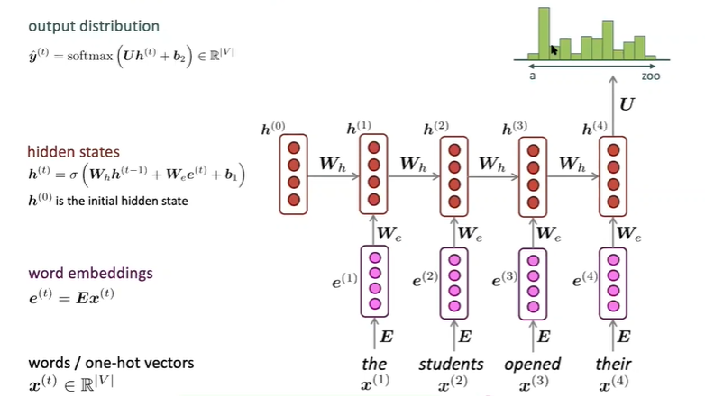

# CS224N NLP with deep learning
## Lecture 5 Recurrent Neural Networks
### Neural based dependency parsing
#### Distributed representation
Represent each word, PoS and dependency labels as $d$ dimension vectors
#### Softmax non-linear classifier
A softmax classifier assigns class $y \in C$ based on inputs $x$ via the probability
$$
p(y|x) = \dfrac{\exp(W_yx)}{\sum_{c=1}^CW_cx}
$$
Train the weight matrix $W$ to minimize loss $\sum_i -\log(p(y_i|x_i))$ (cross entropy loss)  
Softmax is linear, but is non-linear in the underlying representation space 
#### Neural Dependency Model Architecture

### Graph based dependency parser
Compute a score for every possible dependency, requires contextual representation
### Neural graph-based dependency parser
### Neural Networks
#### Regularization
L2 regularization for all parameters $\theta$ to prevent overfitting
$$
\lambda\sum_k\theta^2k
$$
#### Dropout
In training, at each instance of evaluation, randomly set 50% of inputs to each neuron to 0. In testing, halve the model weights. It is a kind of middle ground between Naive Bayes (all feature weights are independent) and logistic regression.  
#### Vectorization
#### Non-linearity

#### Parameter initialization
Initialize matrices with small non-zero random values. Hidden layer bias can be set to 0.  
Xavier initialization, $n$ is the layer size.
$$
\mathsf{Var}(W_i) = \dfrac{2}{n_{in} + n_{out}}
$$
#### Optimizers
plain SGD requires choosing learning rate. Other optimizer: Adagrad, Adam...
#### Learning rate
A constant rate could work. Better results can be achieved by decrease $lr$ when training. $lr = lr_0e^{-kt}$ for epoch $t$. 
### Language models 
#### Language model
Language modelling is the task of predicting the word that comes next.  
Given a sequence of words $x^{(1)},x^{(2)},...,x^{(t)}$, compute the probability distribution of the next word $x^{(t+1)}$:
$$
P(\boldsymbol{x}^{(t+1)}|\boldsymbol{x^{(t)}},...,\boldsymbol{x}^{(1)})
$$ 
where $x^{(t+1)}$ can be any word in the vocabulary $V = \{\boldsymbol{w}_1,...,\boldsymbol{w}_{|V|}\}$
#### n-gram language models
A Markov assumption: $x^{(t+1)}$ depends only on the preceding $n-1$ words
$$
P(\boldsymbol{x}^{(t+1)}|\boldsymbol{x^{(t)}},...,\boldsymbol{x}^{(1)}) = P(\boldsymbol{x}^{(t+1)}|\boldsymbol{x^{(t)}},...,\boldsymbol{x}^{(t-n+2)})\\
= \dfrac{P(\boldsymbol{x}^{(t+1)},\boldsymbol{x^{(t)}},...,\boldsymbol{x}^{(t-n+2)})}{P(\boldsymbol{x}^{(t)},...,\boldsymbol{x}^{(t-n+2)})}
$$  
The probabilities are gained from counting.  
Sparsity problem: maybe the combination never occurred in the data: backoff and smoothing
#### Fixed-window neural language model

### Recurrent Neural Network

Can process text of any length, can use information steps back (in theory), model size is constant, symmetry in how different inputs are processed.  
However, recurrent computation is slow, and its difficult to trace back information