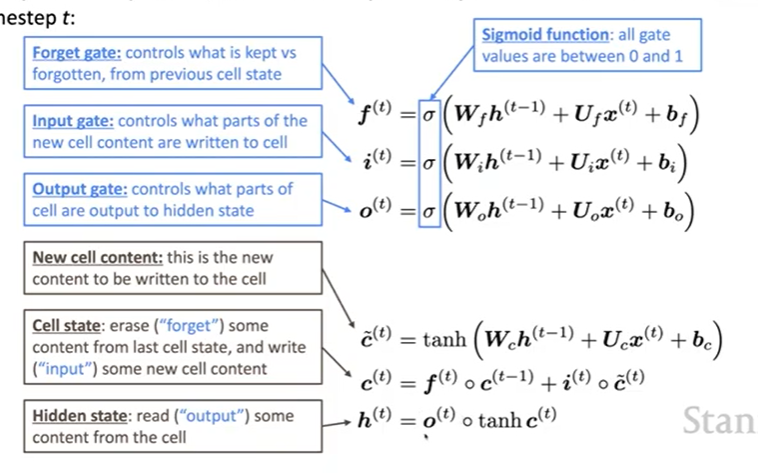

# CS224N NLP with deep learning
## Lecture 6 Simple and LSTM RNNs
### Training of RNN
1. Given a corpus of text
2. Given every word so far, predict the next word, compute the distribution $\hat{y}^{(t)}$
3. Loss function is cross entropy between predicted probability and the true next word
   $$
   J^{(t)}(\theta) = CE(y^{(t)},\hat{y}^{(t)}) = -\sum_{w\in V}y_w^{(t)}\log \hat{y}_w^{(t)} = -\log \hat{y}^{t}_{x_{t+1}}
   $$
4. Overall loss over the training set 
   $$
   J(\theta) = \dfrac{1}{T}\sum_{t=1}^TJ^{(t)}(\theta) = \dfrac{1}{T}\sum_{t=1}^TJ^{(t)}(\theta)-\log \hat{y}^{t}_{x_{t+1}}
   $$
In practice, we don't use the whole corpus, but compute the loss for a batch of sentences then repeat. 
#### Backpropagation
$$
\dfrac{\partial J^{(t)}(\theta)}{\partial \boldsymbol{W}_h} = \sum_{i=1}^t\dfrac{\partial J^{(t)}(\theta)}{\partial \boldsymbol{W}_h}|_i
$$
### Evaluation of language models
#### Perplexity
$$
\prod_{t=1}^T(\dfrac{1}{P_{LM}(x^{(t+1)}|x^{(t)},...,x^{(1)})})^{\dfrac{1}{T}}
= \exp(J(\theta))
$$
### Application of RNN
### Vanishing and exploding gradients
#### Vanishing gradients
$$
h^{(t)} = \sigma(\boldsymbol{W}_hh^{(t-1)} + \boldsymbol{W}_xx^{(t)}+b_1),\sigma(x) =x \\
\dfrac{\partial h^{(t)}}{\partial h^{(t-1)}} = diag(\sigma '(\boldsymbol{W}_hh^{(t-1)} + \boldsymbol{W}_xx^{(t)}+b_1))\boldsymbol{W}_h \\
= \boldsymbol{W}_h
$$
At step $i$, with respect to hidden state $h^{(j)}$, let $l = i-j$
$$
\dfrac{\partial J^{(i)}(\theta)}{\partial h^{(j)}} = \dfrac{\partial J^{(i)}(\theta)}{\partial h^{(i)}}\prod_{j<t\le i}\dfrac{\partial h^{(t)}}{\partial h^{(t-1)}}\\
= \dfrac{\partial J^{(i)}(\theta)}{\partial h^{(i)}}\prod_{j<t\le i}\boldsymbol{W}_h =\dfrac{\partial J^{(i)}(\theta)}{\partial h^{(i)}}\boldsymbol{W}_h^l
$$
The gradient becomes smaller and smaller (all eigenvalues less than 1). Gradient signal from long distances are lost and model weights are updated only with regard to close by terms.'
#### Gradient exploding
If the gradient becomes too big, the update can be too large, resulting in bad parameters.   
Gradient clipping
### Long-short term memory RNN (LSTM)
On each time step, there is a hidden state $h^{(t)}$ and a cell state $c^{(t)}$. The cell stores long term information, and LSTM can read, erase or write information from the cell. The action is controlled by three probability gates.   
  
  
LSTM does not guarantee that there is no vanishing/exploding gradient. Other structures include ResNet, DenseNet...
### Bidirectional and multi-layer LSTM