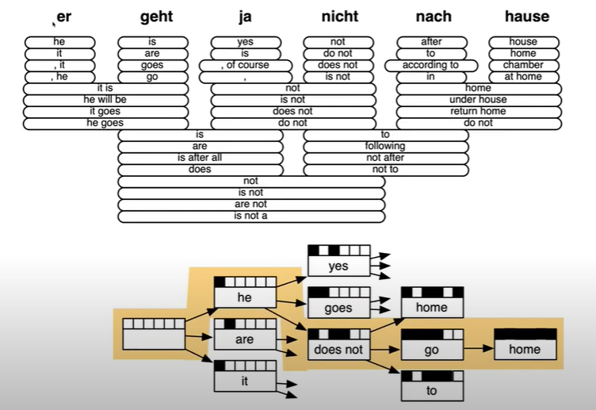
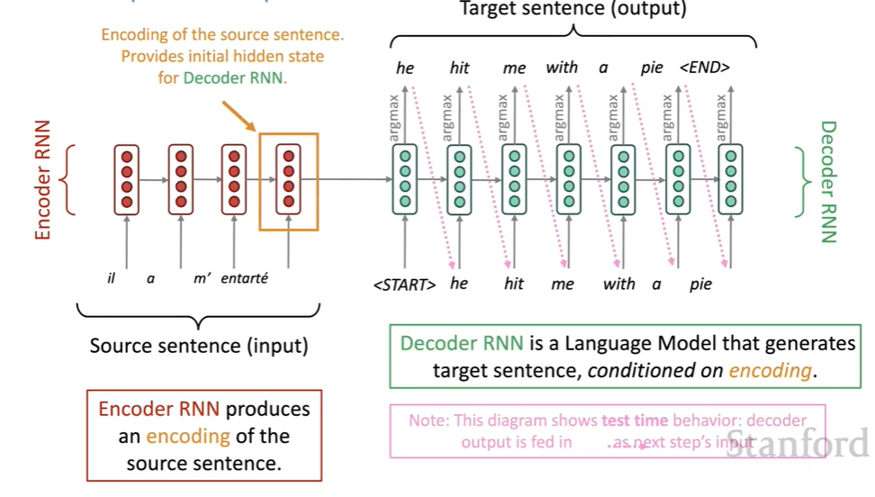

# CS224N NLP with deep learning
## Lecture 7 Translation, Seq2Seq, Attention
### Statistical Machine translation
Translation model: $P(x|y)$   
Add an alignment variable $\alpha$, word-level correspondence between source sentence $x$ and target sentence $y$  
#### Alignment
Typological differences between languages lead to complicated alignments. Alignment can be many-to-one or one-to-many
$P(x,\alpha|y)$ is learned as a combination of many factors, including alignment, fertility...
#### Decoding in SMT

### Neural Machine Translation
A single, large, end-to-end neural network.  
#### seq2seq
Two RNNs: encoder RNN (produce an encoding) and decoder RNN (a language model that generates sentence conditioned on the encoding)    
  
Can be used in: summarization, dialogue, parsing, code generation...  
This is an example of conditional language model. It calculates $P(y|x) = P(y_1|x)P(y_2|y_1,x)...$
#### Training
#### Multi layer RNNs
#### Multi layer deep encoder-decoder machine translation net
#### Greedy decoding
Take $\argmax$ (the most probable word) at each step.
#### Exhaustive search decoding
We want a $T$ that maximizes:  
$P(y|x) = \prod\limits_{t=1}^TP(y_t|y_1,...,y_{t-1},x)$  
But this is too expensive
#### Beam search decoding
On each step of the decoder, keep track of the $k$ (beam size) most probable partial translations (hypotheses)  
A hypothesis has a score $\sum\limits_{i=1}^t\log P_{LM}(y_i|y_1,...y_{i-1},x)$   
This does not guarantee the best solution.   
Different hypothesis might produce end token at different timesteps. It will be put aside to explore other hypothesis.  
It ends until we reach $T$ timesteps or have at least $n$ complete hypothesis.   
The final score is normalized by length, because longer sentences have a lower score. 
### Evaluation
#### BiLingual Evaluation Understudy
BELU compares the machine translation to one or several human translation and compares a similarity score based on :
+ n-gram precision
+ penalty for too short system translation
### Attention
Core idea: on each step of the decoder, use direct connection to the encoder to focus on a particular part of the source sentence. 