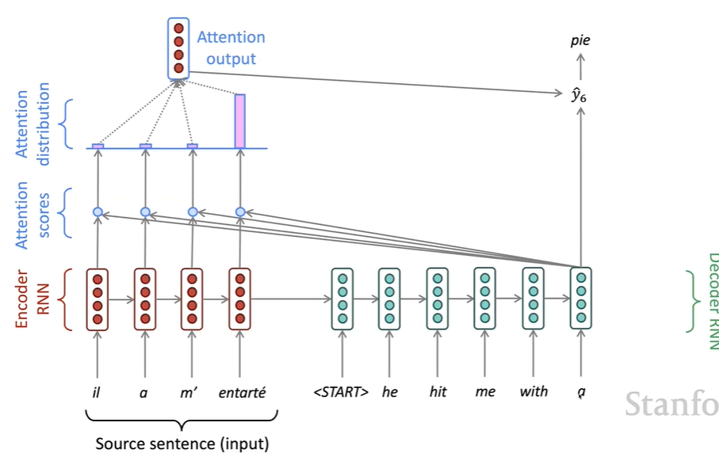

# CS224N NLP with deep learning
## Lecture 8 Attention
### Attention in equations

We have encoder hidden state $h_1,h_2,...,h_N$  
On timestep $t$, we have decoder hidden state $s_t$  
We get the attention score for this step:   
$$
e^t = [S_t^Th_1,...,s_t^Th_n]
$$   
Take softmax to get the attention distribution  
$$
\alpha^t=softmax(e^t)
$$  
Use this to get a weighted sum of the encoder hidden states to get the attention output  
$$
a_t = \sum_{i=1}^N\alpha_t^th_i
$$  
Finally we concatenate the attention output and the decoder hidden state. 
#### Attention is great
It significantly improves NMT performance and makes the process more 'human like'. It solves the bottleneck problem and helps with vanishing gradients. It provides some interoperability. 
#### Attention variants
Attention always involves:
1. The attention score
2. Taking a softmax to get the distribution
3. Using distribution to get a weighted sum.    

Attention score: 
+ basic dot product 
+ multiplicative attention: $e_i = s^TWh_i$, where $W$ is a weighted matrix
+ Reduced rank multiplicative attention: $e_i = s^T(U^TV)h_i$
+ Additive attention: $e_i = v^T\tanh(W_1h_i+W_2s)$
#### Attention is a general DL technique
More general definition: Given a set of vector values, and a vector query, attention is a technique to get a weighted sum of the values, depending on the query. It is a selective summary of the information in the values, a way of getting fix-sized representations from an arbitrary size of values. 