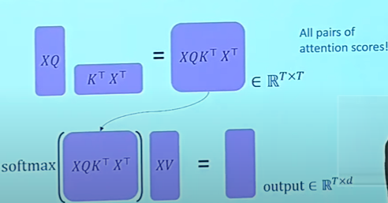
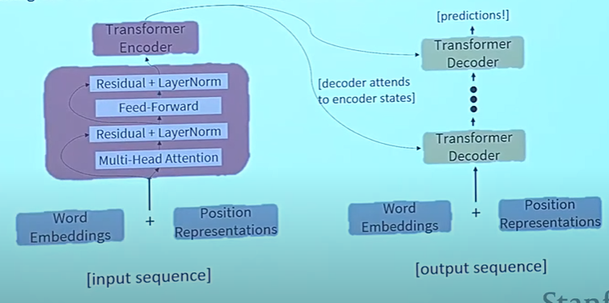

# CS224N NLP with deep learning
## Lecture 9 Self attention and transformers
### Self attention
We have queries, keys and values. In self-attention, all of these come from the same source. If the output of the previous layer is $x_1,...,x_T$, let $v_k=k_i=q_i=x_i$   
Dot product: key-query affinities 
$$
e_{ij} = q_i^Tk_j   \\
\alpha_{ij} = \dfrac{\exp(e_{ij})}{\sum_{j'}\exp(e_{ij'})} \\
output_i = \sum\limits_j\alpha_{ij}v_j
$$
#### Self attention as NLP building block
+ Self attention does not encode order. Consider represent the index as a vector $p_i$ and add it to the keys, queries and values. 
  + Sinusodial position representation
  + Learn the position vector from scratch
+ No non-linearities. We add a feed forward network to post process the output. 
+ We don't look at the future in when predicting a sequence. We use masking. Future attention score is set to $-\infty$
### Transformer model
#### key-query-value attention
Let $x_1,...,x_T$ be the input to the transformer encoder. The keys, queries, and values are:  
$$
k_i = Kx_i \\
q_i = Qx_i \\
v_i = Vx_i
$$
$K,Q,V$ allow different aspects of the $x$ vectors to be emphasized.   
Let $X = [x_1;...;x_T]$  
$$
output = softmax (XQ(XK)^T) \times XV\
$$

#### Multi-headed attention
We define multiple attention heads through multiple $Q,K,V$ matrices.   
Let $Q_l,K_l,V_l \in R^{d\times \frac{d}{h}}$, where $h$ is the number of attention heads and $l$ ranges from $l$ to $h$  
Each attention head performs attention independently.    
$$
output_l = softmax (XQ_l(XK_l)^T) \times XV_l
$$
Then all the outputs are combined together. 
#### training tricks
+ Residual connections: Instead of $X^{i} = layer(X^{i-1}),$ we have $X^{i} =X^{i-1} +  layer(X^{i-1})$
+ Layer normalization: normalizing to unit mean $\mu$ and std $\sigma$ within layer. $output = \dfrac{x-\mu}{\sigma + \epsilon} \cdot \gamma + \beta$
+ Scaled dot product. We divide the attention scores by $\sqrt{\frac{d}{h}}$ to stop the score from becoming too large. 

#### Cross attention (decoder)
Let $h_1,...,h_T$ be outputs of the encoder and $z_1,...,z_T$ be the outputs of the decoder. Keys and values are drawn from the encoder. 
$$
output = softmax(ZQ(HK)^T)\times HV
$$
### Drawbacks and variants
+ Quadratic computation
+ position representations
