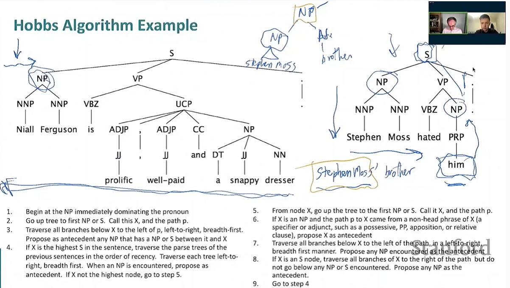
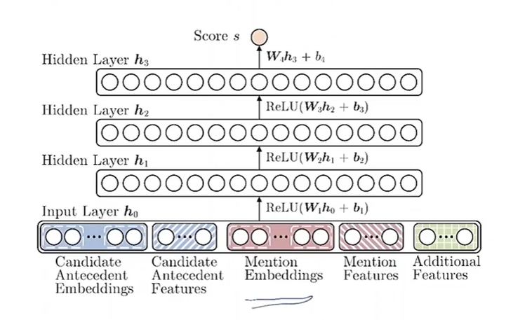
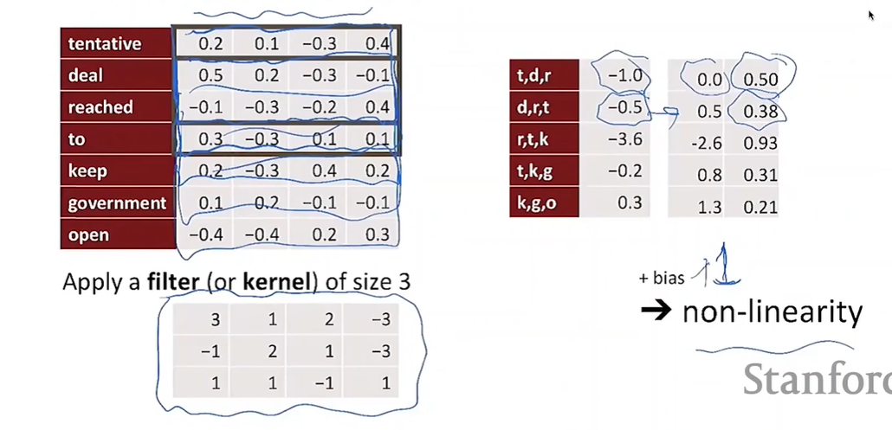
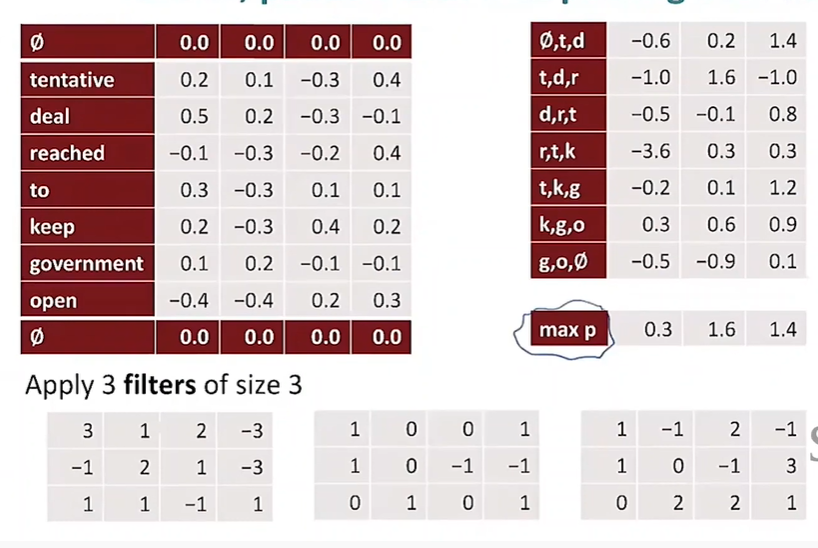
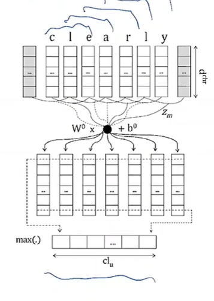
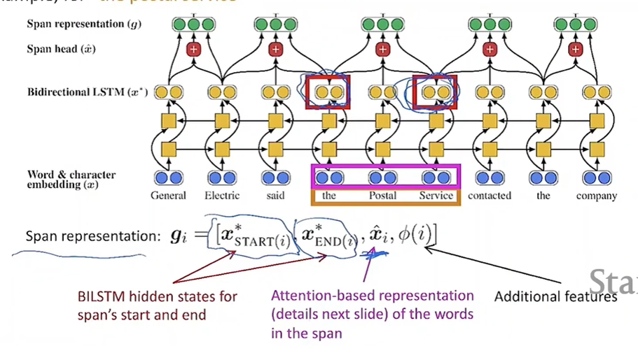
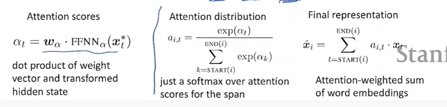

# CS224N NLP with deep learning
## Lecture 13 Coreference resolution
### What is coref resolution:
Find all mentions that refers to the same entity. 
### Mention detection
pronouns-pos tagger    
named entities-ner system  
noun phrases-parser
### Coreference
Coreference: two mentions that refer to the same entity in the world  
Anaphora: A term that refers to anther term in the text  
Not all anaphoric relationships are coreferential.   
Pronominal anaphora: *Every dancer* twisted *her* knee  
Bridging anaphora: We went to see a *concert* last night. *The tickets* were really expensive.  
Cataphora: Look forward for the antecedent of anaphora. 
### Coreference models
#### Rule-based models
Hobb's algorithm:  
  
Winograd Schemas:  
She poured water from the pitcher into the cup until it's full.    
She poured water from the pitcher into the cup until it's empty. 
#### Mention pair
Train a binary classifier for every possible mention pairs whether it is coreferent.  
$$
J = -\sum\limits_{i=2}^N\sum_{j=1}^iy_{ij}\log p(m_j,m_i)
$$  
Pick a threshold and add coreference links between mention pairs where $p(m_j,m_i)$ is above the threshold.   
By transitivity, get the clustering. 
#### Mention ranking
Suppose we have a long document with a list of mentions.   
Assign each mention its highest scoring antecedent according to the model.  
Dummy NA mention allows the model to decline single mentions.  
### Neural Coref model

#### Convolutional Neural Network
Compute vectors for every possible subsequence of words of a certain length.  
  
  
CNN can be used to learn character-level representations for PoS tagging. Convolution over characters to generate fixed size of word embeddings.   

#### End-to-end Neural Coref model

  
Score each pair of spans to decide if they are coreferent mentions.  
$$
s(i,j) = s_m(i) + s_m(j) + s_a(i,j) 
$$  
The scoring function takes the span representation as input.  
#### Clustering