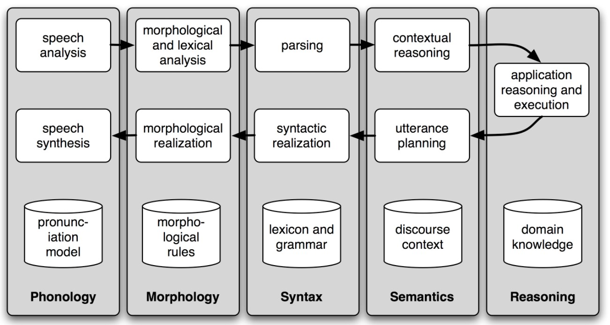

# Natural Language Processing with Python
## Chapter 1 Language Processing and Python
### 1. Computing with Language: Texts and Words
#### 1.1 Getting started with Python
#### 1.2 Getting started with NLTK
#### 1.3 Searching text
#### 1.4 Counting Vocabulary
A **token** is the name for a sequence of characters that we want to treat as a group.   
A **word type** is the form or spelling of the word independently of its specific occurrences in a text, that is, the word considered as a unique item of vocabulary. **Type** also includes punctuation symbols.   
By dividing tokes by types, we have **lexical diversity**.
### 2. A Closer Look at Python: Texts as Lists of Words
#### 2.1 Lists
#### 2.2 Indexing Lists
#### 2.3 Variables
#### 2.4 Strings
### 3. Computing with Language: Simple Statistics
#### 3.1 Frequency distributions
A **frequency distribution** tells us the frequency of each vocabulary item in the text.   
A **hapax** is a word that only occur once only. 
#### 3.2 Fine-grained Selection of Words
The set of all $w$ such that $w$ is an element of vocabulary $V$ and has property $P$.  
$\{w|w\in V\&P(w)\}$
#### 3.3 Collocations and Bigrams
A **collocation** is a sequence of words that occur together unusually often.   
A **bigram** is a list of word pairs.
#### 3.4 Counting Other Things
### 4. Back to Python: Making Decisions and Taking Control
#### 4.1 Conditionals
#### 4.2 Operating on Every Element
#### 4.3 Nested Code Blocks
#### 4.4 Looping with Conditions
### 5. Automatic Natural Language understanding
#### 5.1 Word Sense Disambiguation
Definition of serve:  
> a. serve: help with food or drink; hold an office; put ball into play  
> b. dish: plate; course of a meal; communications device  

Meaning of by:
>a. The lost children were found by the searchers (agentive)  
>b. The lost children were found by the mountain (locative)  
>c. The lost children were found by the afternoon (temporal)
#### 5.2 Pronoun Resolution
>a. The thieves stole the paintings. They were subsequently sold.  
>b. The thieves stole the paintings. They were subsequently caught.  
>c. The thieves stole the paintings. They were subsequently found.

The task is to find the **antecedent** of the pronoun.  
**Anaphora resolution** is identifying what a pronoun or noun phrase refers to.  
**Semantic role labelling** is identifying how a noun phrase relates to the verb.
#### 5.3 Generating Language Output
#### 5.4 Machine Translation
#### 5.5 Spoken Dialog Systems

#### 5.6 Textual Entailment
>a. Text: David Golinkin is the editor or author of eighteen books, and over 150 responsa, articles, sermons and books  
>b. Hypothesis: Golinkin has written eighteen books
#### 5.7 Limitations of NLP
### 6. Summary
### 7. Further Reading
### 8. Exercises