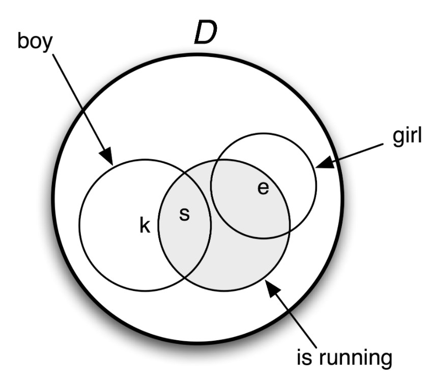
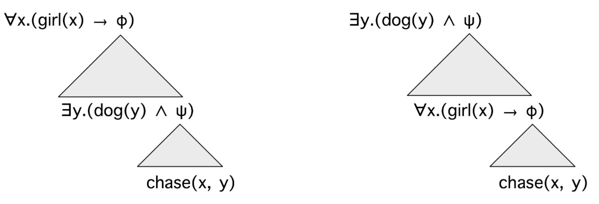
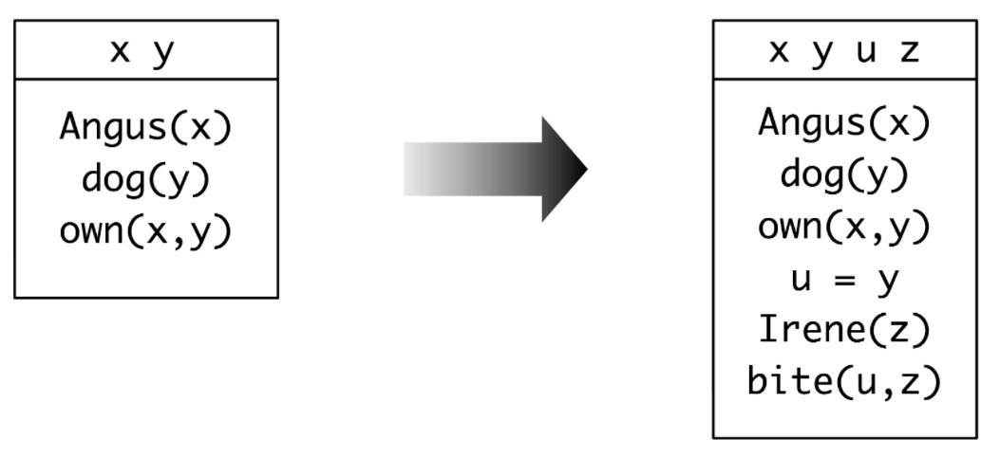

# Natural Language Processing with Python
## Chapter 10 Analyzing the Meaning of Sentences
### 1. Natural Language Understanding
#### 1.1 Querying a Database
#### 1.2 Natural Language, Semantics and Logic
+ declarative sentences are true or false in certain situations. 
+ definite noun phrases and proper nouns refer to things in the world
+ consistent and inconsistent sentences
+ A **model** for a set W of sentences is a formal representation of a situation in which all the sentences in W are true. The domain D of discourse is a set of individuals, while relations are treated as sets built up from D.   

### 2 Propositional Logic
[Klaus chased Evi] and [Evi ran away]  
φ & ψ.  
First, every propositional letter is a formula. Then if φ is a formula, so is -φ. And if φ and ψ are formulas, then so are (φ & ψ) (φ | ψ) (φ -> ψ) (φ <-> ψ)   
an **argument**. The sentence Sylvania is to the north of Freedonia is the **assumption** of the argument while Freedonia is not to the north of Sylvania is the **conclusion**. The step of moving from one or more assumptions to a conclusion is called **inference**. An argument is **valid** if there is no possible situation in which its premises are all true and its conclusion is not true.
### 3. First-Order Logic
#### 3.1 Syntax
**terms** such as individual variables and individual constants, and **predicates** which take differing numbers of **arguments**.  
**logical constants** (such as the boolean operators) always receive the same interpretation in every model for first-order logic.  
Equality is regarded as a logical constant, since for individual terms t1 and t2, the formula t1 = t2 is true if and only if t1 and t2 refer to one and the same entity.  
**basic types**: e is the type of entities, while t is the type of formulas, i.e., expressions which have truth values. 
**complex types** for function expressions. That is, given any types σ and τ, 〈σ, τ〉 is a complex type corresponding to functions from 'σ things' to 'τ things'.  
a **signature**, implemented as a dictionary that explicitly associates types with non-logical constants   
**existential quantifier ∃x** ('for some x')  
**universal quantifier ∀x** ('for all x')  
In general, an occurrence of a variable x in a formula φ is **free** in φ if that occurrence doesn't fall within the scope of all x or some x in φ. Conversely, if x is free in formula φ, then it is **bound** in all x.φ and exists x.φ. If all variable occurrences in a formula are bound, the formula is said to be **closed**.  
#### 3.2 First Order Theorem Proving
The general case in theorem proving is to determine whether a formula that we want to prove (a proof goal) can be derived by a finite sequence of inference steps from a list of assumed formulas. We write this as S ⊢ g, where S is a (possibly empty) list of assumptions, and g is a proof goal.
#### 3.3 Summarizing the Language of First Order Logic
en, t〉 is the type of a predicate which combines with n arguments of type e to yield an expression of type t. In this case, we say that n is the **arity** of the predicate.
+ If P is a predicate of type 〈en, t〉, and α1, ... αn are terms of type e, then P(α1, ... αn) is of type t.
+ If α and β are both of type e, then (α = β) and (α != β) are of type t.
+ If φ is of type t, then so is -φ.
+ If φ and ψ are of type t, then so are (φ & ψ), (φ | ψ), (φ -> ψ) and (φ <-> ψ).
+ If φ is of type t, and x is a variable of type e, then exists x.φ and all x.φ are of type t.
#### 3.4 Truth in Model
Given a first-order logic language L, a model M for L is a pair 〈D, Val〉, where D is an nonempty set called the domain of the model, and Val is a function called the valuation function which assigns values from D to expressions of L as follows:
+ For every individual constant c in L, Val(c) is an element of D.
+ For every predicate symbol P of arity n ≥ 0, Val(P) is a function from Dn to {True, False}. (If the arity of P is 0, then Val(P) is simply a truth value, the P is regarded as a propositional symbol.)
#### 3.5 Individual Variables and Assignments
#### 3.6 Quantification
#### 3.7 Quantifier Scope Ambiguity
Everybody admires someone.      

a. all x.(person(x) -> exists y.(person(y) & admire(x,y)))    
b. exists y.(person(y) & all x.(person(x) -> admire(x,y)))
#### 3.8 Model Building
### 4 The Semantics of English Sentences
#### 4.1 Compositional Semantics in Feature-Based Grammar
**Principle of Compositionality**: The meaning of a whole is a function of the meanings of the parts and of the way they are syntactically combined.
#### 4.2 The λ-Calculus
So the general picture is this: given an open formula φ with free variable x, abstracting over x yields a property expression λx.φ — the property of being an x such that φ.   
If α is of type τ, and x is a variable of type e, then \x.α is of type 〈e, τ〉.
#### 4.3 Quantified NPs
#### 4.4 Transitive Verbs
#### 4.5 Quantifier Ambiguity Revisited

ooper storage, a semantic representation is no longer an expression of first-order logic, but instead a pair consisting of a "core" semantic representation plus a list of binding operators
### 5 Discourse Semantics
A discourse is a sequence of sentences.
#### 5.1  Discourse Representation Theory
 A discourse representation structure (DRS) presents the meaning of discourse in terms of a list of discourse referents and a list of conditions. The discourse referents are the things under discussion in the discourse, and they correspond to the individual variables of first-order logic. The DRS conditions apply to those discourse referents, and correspond to atomic open formulas of first-order logic. 

#### 5.2 Discourse Processing
### 6 Summary
### 7 Further Reading
### 8 Exercises