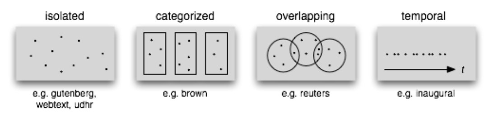
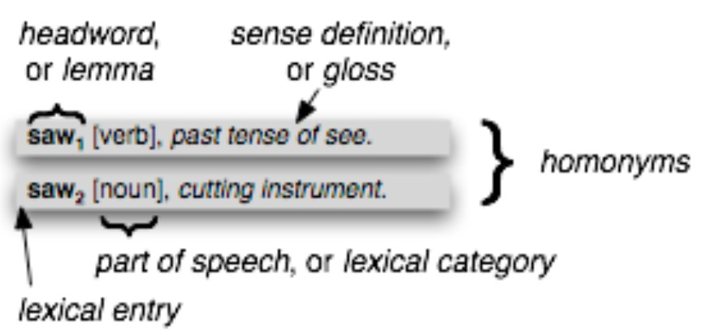
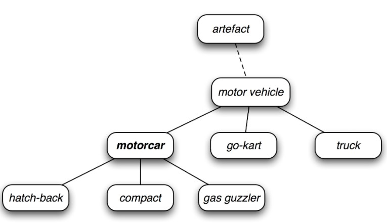

# Natural Language Processing with Python
## Chapter 2 Accessing Text Corpora and Lexical Resources
### 1 Accessing Text Corpora
#### 1.1 Gutenberg Corpus
A small selection of texts from the Project Gutenberg electronic text archive.
#### 1.2 Web and Chat Text
Content from a Firefox discussion forum, conversations overheard in New York, the movie script of Pirates of the Carribean, personal advertisements, and wine reviews.
#### 1.3 Brown Corpus
Contains text from 500 sources, and the sources have been categorized by genre.  
**Stylistics** is the study of the differences between genres. 
#### 1.4 Reuters Corpus
Contains 10,788 news documents totaling 1.3 million words. The documents have been classified into 90 topics, and grouped into two sets, called "training" and "test". Unlike the Brown Corpus, categories in the Reuters corpus overlap with each other, because a news story often covers multiple topics.
#### 1.5 Inaugural Address Corpus
A collection of 55 texts, one for each presidential address.
#### 1.6 Annotated Text Corpora
Contain linguistic annotations, representing POS tags, named entities, syntactic structures, semantic roles, and so forth.
#### 1.7 Corpora in Other Languages
#### 1.8 Text Corpus Structure  

#### 1.9 Loading your own Corpus
### 2 Conditional Frequency Distributions
A **conditional frequency distribution** is a collection of frequency distributions, each one for a different "condition".
#### 2.1 Conditions and Events
#### 2.2 Counting Words by Genre
#### 2.3 Plotting and Tabulating Distributions
#### 2.4 Generating Random Text with Bigrams
### 3 More Python: Reusing Code
#### 3.1 Creating Programs with a Text Editor
#### 3.2 Functions
#### 3.3 Modules
### 4 Lexical Resources
A **lexicon**, or lexical resource, is a collection of words and/or phrases along with associated information such as part of speech and sense definitions.  
A **lexical entry** consists of a **headword** (also known as a **lemma**) along with additional information such as the part of speech and the sense definition. Two distinct words having the same spelling are called **homonyms**.  

#### 4.1 Wordlist Corpora
+ A corpus of wordlists
+ A corpus of stopwords
+ A corpus of names

**Stopwords**, are high-frequency words like *the*, *to* and *also* that we sometimes want to filter out of a document before further processing.
#### 4.2 A Pronouncing Dictionary
#### 4.3 Comparative Wordlists
Lists of about 200 common words in several languages.
#### 4.4 Shoebox and Toolbox Lexicons
A **Toolbox** file consists of a collection of entries, where each entry is made up of one or more fields.
### 5 WordNet
WordNet is a semantically-oriented dictionary of English
#### 5.1 Senses and Synonyms
A **synset**, or "synonym set", a collection of synonymous words (or "lemmas")
#### 5.2 The WordNet Hierarchy
WordNet synsets correspond to abstract concepts. These concepts are linked together in a hierarchy. Some general concepts, such as *Entity*, *State*, *Event* are called **unique beginners** or **root synsets**. **Hyponyms** are concepts that are more specific. Navigate up the hierarchy by visiting **hypernyms**.

#### 5.3 More Lexical Relations
Hypernyms and hyponyms are called **lexical relations**. Another way to navigate the WordNet is from items to their components (**meronyms**) or to the things they are contained in (**holonyms**). For verbs, walking involves stepping, so walking **entails** stepping. Some lexical relationships hold between lemmas, like **antonymy**.  
#### 5.4 Semantic Similarity
We can quantify the concept of generality by looking up the depth of each synset. `path_similarity` assigns a score in the range 0–1 based on the shortest path that connects the concepts in the hypernym hierarchy.
### 6 Summary 
### 7 Further Reading
### 8 Exercises