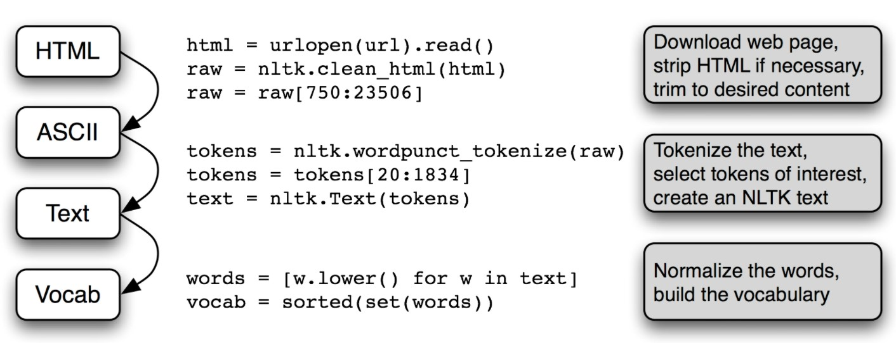
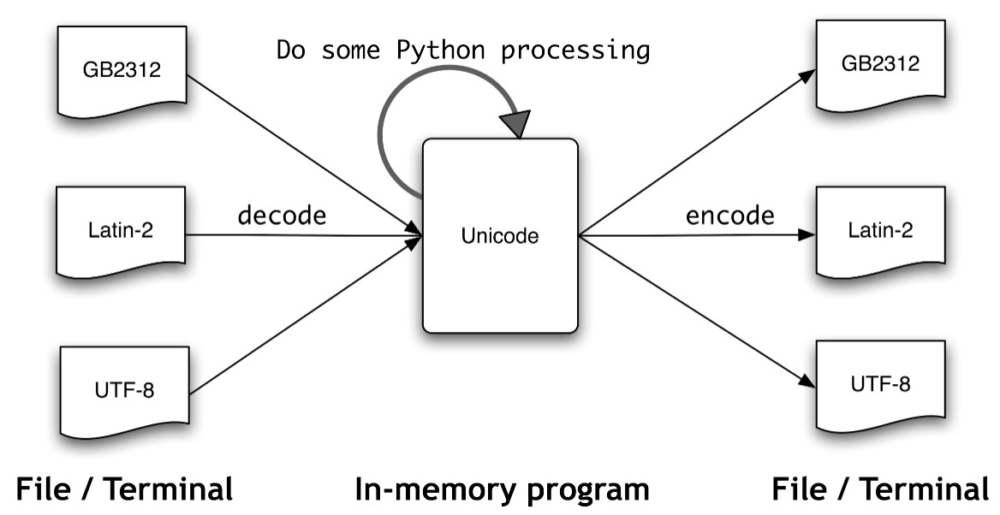
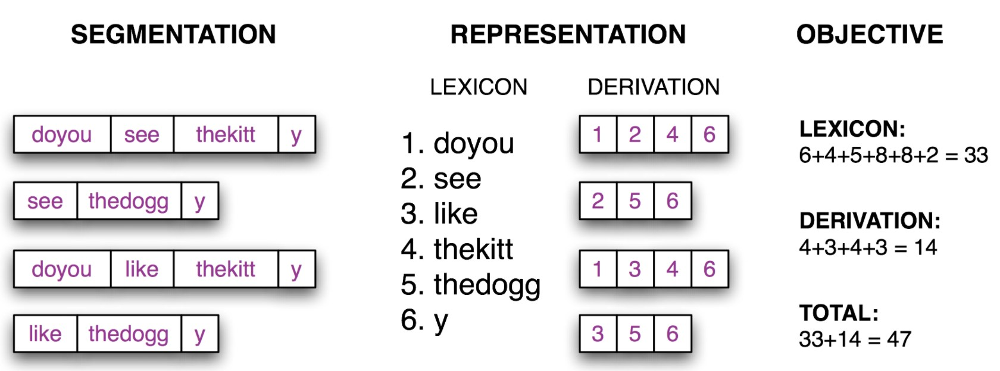

# Natural Language Processing with Python
## Chapter 3 Processing Raw Text
### 3.1 Accessing Text from the Web and from Disk
#### Electronic books
#### Dealing with HTML
#### Processing Search Engine Results
#### Processing RSS feeds
#### Reading local files
#### Extracting Text from PDF, MSWord and other Binary Formats
#### Capturing User Input
#### The NLP Pipeline

### 3.2 Strings: Text Processing at the Lowest Level
#### Basic Operations with Strings
#### Printing Strings
#### Accessing Individual Characters
#### Accessing Substrings
#### More operations on strings
#### The Difference between Lists and Strings
### 3.3 Text Processing with Unicode
#### What is Unicode?

#### Extracting encoded text from files
#### Using your local encoding in Python
### 3.4 Regular Expressions for Detecting Word Patterns
#### Using Basic Meta-Characters
#### Ranges and Closures
**Textnoyms** are words that are entered with the same sequence of keystrokes.
### 3.5 Useful Applications of Regular Expressions
#### Extracting Word Pieces
#### Doing More with Word Pieces
#### Finding Word Stems
#### Searching Tokenized Text
### 3.6 Normalizing Text
#### Stemmers
#### Lemmatization
### 3.7 Regular Expressions for Tokenizing Text
#### Simple Approaches to Tokenization
#### NLTK's Regular Expression Tokenizer
#### Further Issues with Tokenization
### 3.8 Segmentation
#### Sentence Segmentation
#### Word Segmentation

Given a hypothetical segmentation of the source text, derive a lexicon and a derivation table that permit the source text to be reconstructed, then total up the number of characters used by each lexical item (including a boundary marker) and the number of lexical items used by each derivation, to serve as a score of the quality of the segmentation; smaller values of the score indicate a better segmentation.  
### 3.9 Formatting: From Lists to Strings
#### From Lists to Strings
#### Strings and Formats
#### Lining Things Up
#### Writing Results to a File
#### Text Wrapping
### 3.10 Summary
### 3.11 Further Reading
### 3.12 Exercises