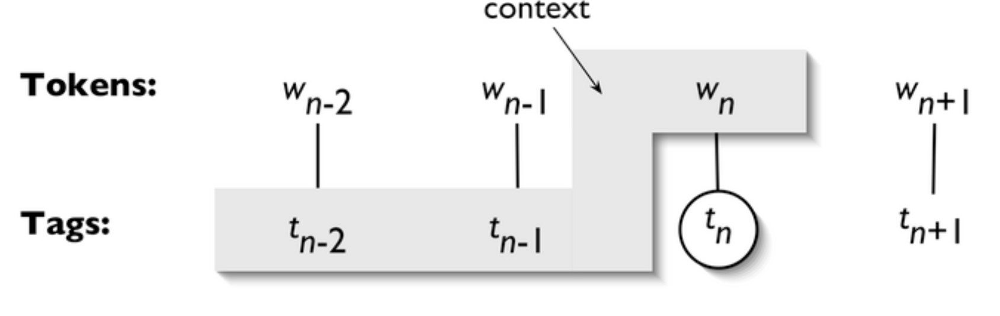

# Natural Language Processing with Python
## Chapter 5 Categorizing and Tagging Words
### 1. Using a Tagger
### 2. Tagged Corpora
#### 2.1 Representing Tagged Tokens
#### 2.2 Reading Tagged Corpora
#### 2.3 A Universal Part-of-Speech Tagset
|  Tag  |       Meaning       |
| :---: | :-----------------: |
|  ADJ  |      adjective      |
|  ADP  |     adposition      |
|  ADV  |       adverb        |
| CONJ  |     conjunction     |
|  DET  | determiner, article |
| NOUN  |        noun         |
|  NUM  |       numeral       |
|  PRT  |      particle       |
| PRON  |       pronoun       |
| VERB  |        verb         |
|   .   |  punctuation marks  |
|   X   |        other        |
#### 2.4 Nouns
`N` for noun, `NP` for proper names
#### 2.5 Verbs
`VBD` for past tense, `VBN` for past participle
#### 2.6 Adjectives and Adverbs
#### 2.7 Unsimplified Tags
#### 2.8 Exploring Tagged Corpora
### 3. Mapping Words to Properties Using Python Dictionaries
#### 3.1 Indexing Lists vs Dictionaries
#### 3.2 Dictionaries in Python
#### 3.3 Defining Dictionaries
#### 3.4 Default Dictionaries
#### 3.5 Incrementally Updating a Dictionary
#### 3.6 Complex Keys and Values
#### 3.7 Inverting a Dictionary
### 4. Automatic Tagging
#### 4.1 The Default Tagger 
Assigns the same tag to every token.
#### 4.2 The Regular Expression Tagger
Assigns tags according to patterns.
#### 4.3 The Lookup Tagger
Assigns the most possible tag. When it doesn't work, **backoff** to other taggers.
#### 4.4 Evaluation
### 5. N-Gram Tagging
#### 5.1 Unigram Tagging
#### 5.2 Separating the Training and Testing Data
#### 5.3 General N-Gram Tagging

#### 5.4 Combining Taggers
#### 5.5 Tagging Unknown Words
#### 5.6 Storing Taggers
#### 5.7 Performance Limitations
### 6. Transformation-Based Tagging
Assigns the tag, and then find rules in the training data to correct the tags. The rules are evaluated by $fixed-broken$, where fixed means correctly modified cases, and broken means incorrectly modified cases. Sometimes the rules are linguistically explainable. 
### 7. How to Determine the Category of a Word
#### 7.1 Morphological Clues
#### 7.2 Syntactic Clues
#### 7.3 Semantic Clues
#### 7.4 New Words
#### 7.5 Morphology in Part of Speech Tagsets
### 8. Summary
### 9. Further Reading
### 10. Exercises
    