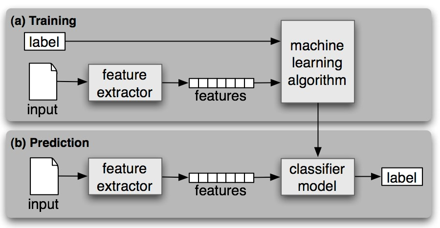
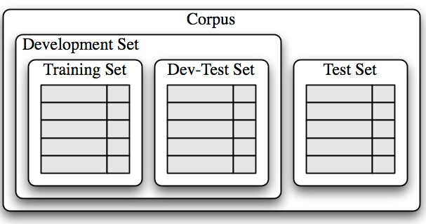
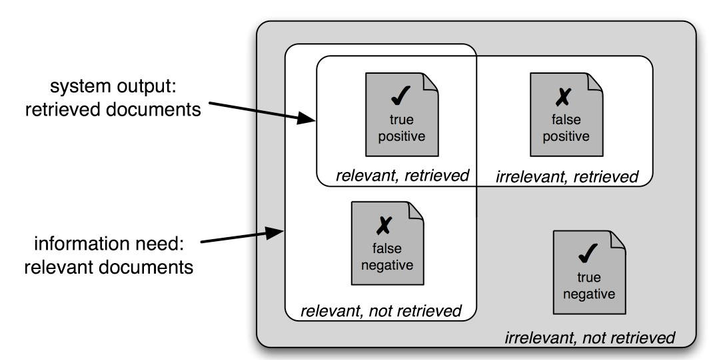
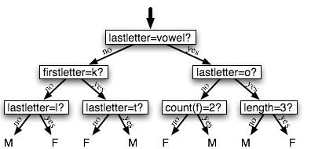
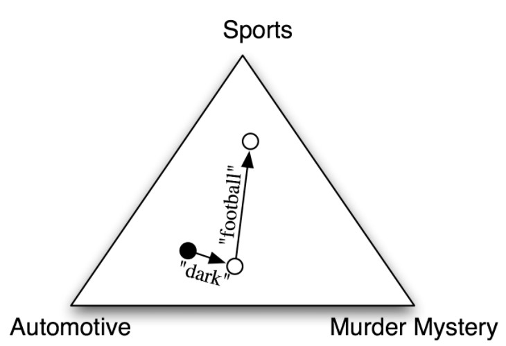
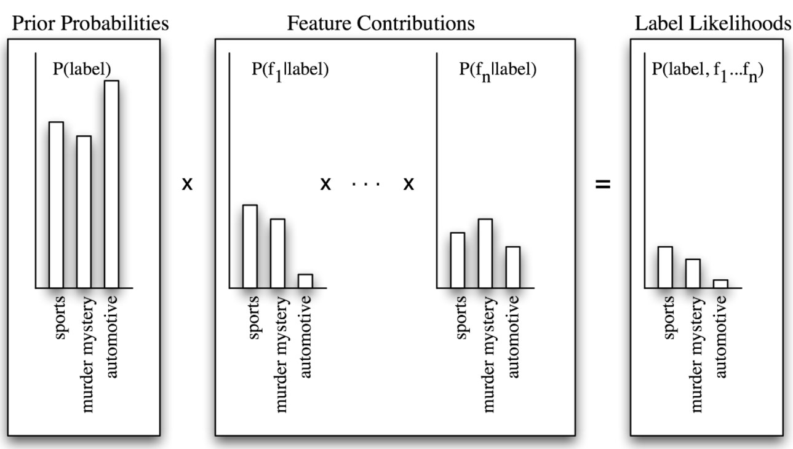

# Natural Language Processing with Python
## Chapter 5 Learning to Classify Text
### 1 Supervised Classification

#### 1.1 Gender Identification
#### 1.2 Choosing The Right Features

After training, test on dev-test set, and perform error analysis, then adjust the feature set accordingly. 
#### 1.3 Document Classification
#### 1.4 Part-of-Speech Tagging
#### 1.5 Exploiting Context
#### 1.6 Sequence Classification
**consecutive classification** or **greedy sequence classification**, is to find the most likely class label for the first input, then to use that answer to help find the best label for the next input. 
#### 1.7 Other Methods for Sequence Classification
**Hidden Markov Models** generate a probability distribution over tags. These probabilities are then combined to calculate probability scores for tag sequences, and the tag sequence with the highest probability is chosen.
### 2. Further Examples of Supervised Classification
#### 2.1 Sentence Segmentation
#### 2.2 Identifying Dialogue Act Types
#### 2.3 Recognizing Textual Entailment
#### 2.4 Scaling Up to Large Datasets
### 3. Evaluation
#### 3.1 The Test Set
#### 3.2 Accuracy
the percentage of inputs in the test set that the classifier correctly labeled
#### 3.3 Precision and Recall

$TP$: True Positive  
$TN$: True Negative  
$FP$: False Positive, Type 1 error  
$FN$: False Negative, Type 2 error  
$Pr$: Precision, $\frac{TP}{TP+FP}$  
$Re$: Recall, $\frac{TP}{TP+FN}$  
$F$: F-score, $\frac{2*Pr*Re}{Pr+Re}$
#### 3.4 Confusion Matrices
A **confusion matrix** is a table where each cell [i,j] indicates how often label j was predicted when the correct label was i.
#### 3.5 Cross-Validation
Subdivide the original corpus into N subsets called folds. For each of these folds, we train a model using all of the data except the data in that fold, and then test that model on the fold.
### 4. Decision Trees
**Decision trees** contain **decision nodes**, which check feature values, and **leaf nodes**, which assign labels. The initial condition node is called the **root node**. A **decision stump** is a decision tree with a single node that decides how to classify inputs based on a single feature.   
The simplest method is to just build a decision stump for each possible feature, and see which one achieves the highest accuracy on the training data, although there are other alternatives that we will discuss below. Once we've picked a feature, we can build the decision stump by assigning a label to each leaf based on the most frequent label for the selected examples in the training set  
We begin by selecting the overall best decision stump for the classification task. We then check the accuracy of each of the leaves on the training set. Leaves that do not achieve sufficient accuracy are then replaced by new decision stumps, trained on the subset of the training corpus that is selected by the path to the leaf.
#### 4.1 Entropy and Information Gain
**information gain**, measures how much more organized the input values become when we divide them up using a given feature. To measure how disorganized the original set of input values are, we calculate entropy of their labels, which will be high if the input values have highly varied labels, and low if many input values all have the same label. In particular, entropy is defined as the sum of the probability of each label times the log probability of that same label:  
$H = −\sum\limits_{l\in labels}P(l)× \log_2P(l)$  
Once we have calculated the entropy of the original set of input values' labels, we can determine how much more organized the labels become once we apply the decision stump. To do so, we calculate the entropy for each of the decision stump's leaves, and take the average of those leaf entropy values (weighted by the number of samples in each leaf). The information gain is then equal to the original entropy minus this new, reduced entropy.  

### 5. Naive Bayes Classifiers
To choose a label for an input value, the naive Bayes classifier begins by calculating the prior probability of each label, which is determined by checking frequency of each label in the training set. The contribution from each feature is then combined with this prior probability, to arrive at a likelihood estimate for each label. The label whose likelihood estimate is the highest is then assigned to the input value.  

#### 5.1 Underlying Probabilistic Model
it chooses the most likely label for an input, under the assumption that every input value is generated by first choosing a class label for that input value, and then generating each feature, entirely independent of every other feature. This is known as the **naive Bayes assumption**. F for feature, L for label.  
$P(l|F) = \frac{P(F,l)}{P(F)}$  
$P(F,l) = P(l)*P(F|l)$
$=P(l)*\prod\limits_{f\in F}P(f|l)$
#### 5.2 Zero Counts and Smoothing
$P(F|l) = \frac{count(f,l)}{count(l)}$   
When $count(f,l)$ equals zero, the estimate becomes unreliable. To solve that, we use **smoothing** techniques such as the **Expected Likelihood Estimation** or **Heldout Estimation**
#### 5.3 Non-Binary Features
#### 5.4 The Naivete of Independence
#### 5.5 The Cause of Double-Counting
During training, feature contributions are computed separately; but when using the classifier to choose labels for new inputs, those feature contributions are combined. This causes double counting when we have two interdependent features. We can solve this by assigning parameters, or **weights** for the model.
$P(F,l)=\mathbf{w}[l]*\prod\limits_{f\in F}\mathbf{w}[f,l]$  
$\mathbf{w}[l]=P(l)$  
$\mathbf{w}[f,l]=P(f,l)$
### 6. Maximum Entropy Classifiers
it uses search techniques to find a set of parameters that will maximize the performance of the classifier. In particular, it looks for the set of parameters that maximizes the **total likelihood** of the training corpus, which is defined as:   
$P(F)=\sum\limits_{x\in corpus}P(l(x)|F(x))$   
$P(l|F)=\frac{p(l,F)}{\sum\limits_l P(l,F)}$  
#### 6.1 The Maximum Entropy Model
Each combination of labels and features that receives its own parameter is called a **joint-feature**.  
$P(Input,l)=\prod\limits_{jointF(Input|l)}\mathbf{w}[jointf]$
#### 6.2 Maximizing Entropy
#### 6.3 Generative vs Conditional Classifiers
### 7. Modeling Linguistic Patterns
#### 7.1 What do models tell us?
### 8. Summary
### 9. Further Reading
### 10. Exercises