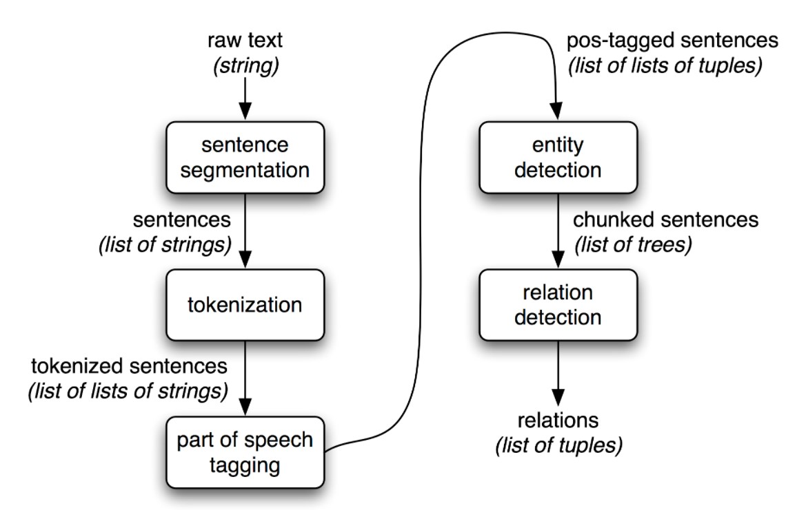
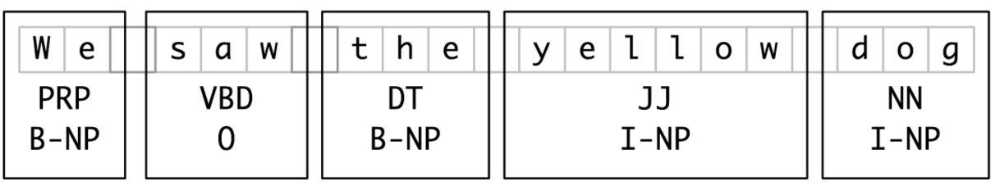
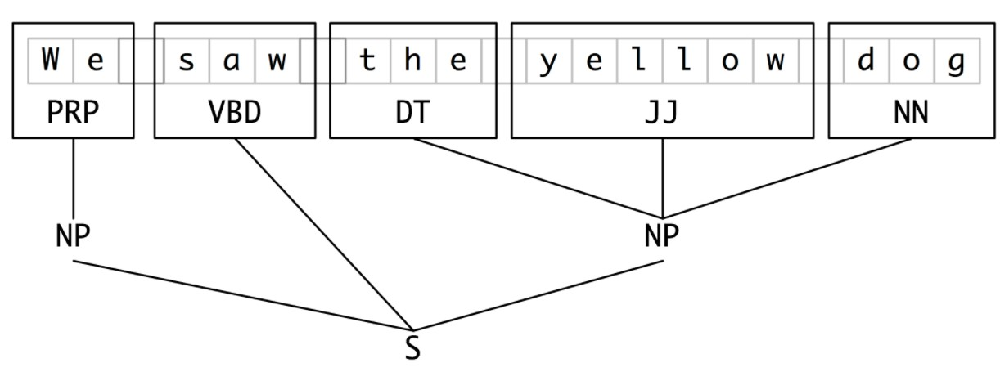

# Natural Language Processing with Python
## Chapter 7 Extracting Information from Text
### 1. Information Extraction
#### 1.1 Information Extraction Architecture

### 2 Chunking
#### 2.1 Noun Phrase Chunking
#### 2.2 Tag Patterns
#### 2.3 Chunking with Regular Expressions
#### 2.4 Exploring Text Corpora
#### 2.5 Chinking
A chink is a sequence of tokens that is not included in a chunk
#### 2.6 Representing Chunks: Tags vs Trees
IOB tags:  

### 3 Developing and Evaluating Chunkers
#### 3.1 Reading IOB Format and the CoNLL 2000 Corpus
#### 3.2 Simple Evaluation and Baselines
#### 3.3 Training Classifier-Based Chunkers
### 4. Recursion in Linguistic Structure
#### 4.1 Building Nested Structure with Cascaded Chunkers
#### 4.2 Trees
#### 4.3 Tree Traversal
### 5. Named Entity Recognition
### 6. Relation Extraction
### 7. Summary
### 8. Further Reading
### 9. Exercises

