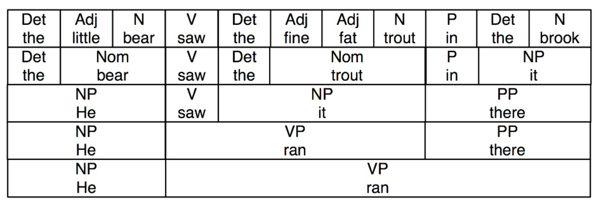
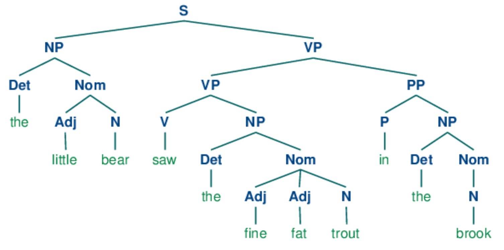
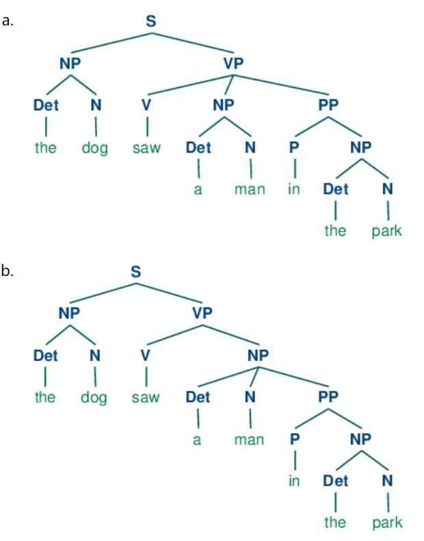
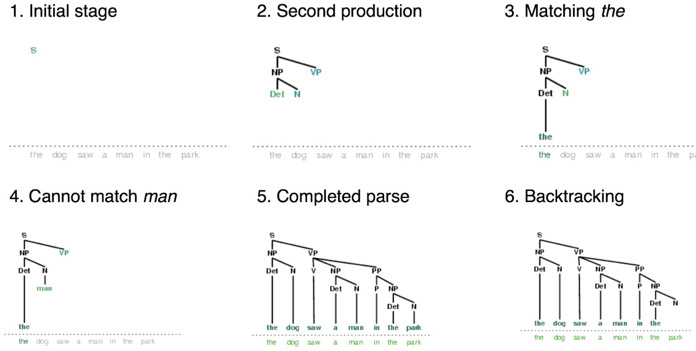
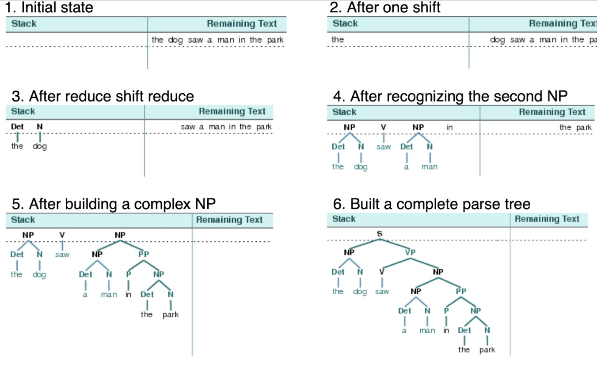
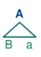
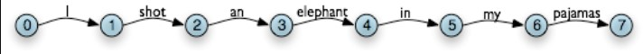
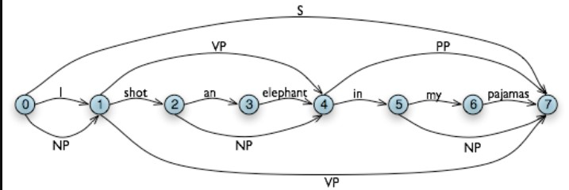
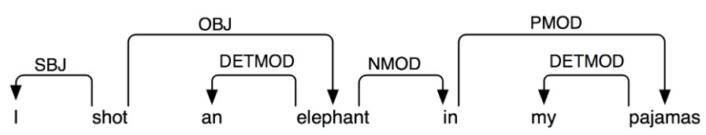

# Natural Language Processing with Python
## Chapter 8 Analyzing Sentence Structure
### 1 Some Grammatical Dilemmas
#### 1.1 Linguistic Data and Unlimited Possibilities
#### 1.2 Ubiquitous Ambiguity
### 2. What's the Use of Syntax?
#### 2.1 Beyond n-grams
**Constituent structure** is based on the observation that words combine with other words to form units. The evidence that a sequence of words forms such a unit is given by substitutability — that is, a sequence of words in a well-formed sentence can be replaced by a shorter sequence without rendering the sentence ill-formed.     

Each node in this tree (including the words) is called a **constituent**. The immediate constituents of S are NP and VP.  

### 3. Context Free Grammar
#### 3.1 A Simple Grammar
Structure ambiguous 

#### 3.2 Writing Your Own Grammars
#### 3.3 Recursion in Syntactic Structure
### 4. Parsing With Context Free Grammar
#### 4.1 Recursive Descent Parsing
The top-level goal is to find an S. The S → NP VP production permits the parser to replace this goal with two subgoals: find an NP, then find a VP. Each of these subgoals can be replaced in turn by sub-sub-goals, using productions that have NP and VP on their left-hand side. Eventually, this expansion process leads to subgoals such as: find the word telescope. Such subgoals can be directly compared against the input sequence, and succeed if the next word is matched. If there is no match the parser must back up and try a different alternative.  

#### 4.2 Shift-Reduce Parsing
The shift-reduce parser repeatedly pushes the next input word onto a stack; this is the shift operation. If the top n items on the stack match the n items on the right hand side of some production, then they are all popped off the stack, and the item on the left-hand side of the production is pushed on the stack. This replacement of the top n items with a single item is the reduce operation. This operation may only be applied to the top of the stack; reducing items lower in the stack must be done before later items are pushed onto the stack. The parser finishes when all the input is consumed and there is only one item remaining on the stack, a parse tree with an S node as its root. The shift-reduce parser builds a parse tree during the above process. Each time it pops n items off the stack it combines them into a partial parse tree, and pushes this back on the stack. 

#### 4.3 The Left-Corner Parser
we say that a category B is a left-corner of a tree rooted in A if A ⇒* B α.  

#### 4.4 Well-Formed Substring Tables
we will assume each word has a unique lexical category, and we will store this (not the word) in the matrix. So cell $(1, 2)$ will contain the entry `V`. More generally, if our input string is $a_0a_1 ... a_n$, and our grammar contains a production of the form $A → a_i$, then we add A to the cell $(i, `i`+1)$.

### 5 Dependencies and Dependency Grammar

#### 5.1 Valency and the Lexicon
#### 5.2 Scaling Up
### 6. Grammar Development
#### 6.1 Treebanks and Grammars
#### 6.2 Pernicious Ambiguity
#### 6.3 Weighted Grammar
### 7 Summary
### 8 Further Reading
### 9 Exercises