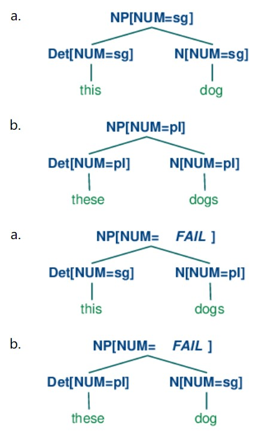

# Natural Language Processing with Python
## Chapter 9 Building Feature Based Grammars
### 1. Grammatical Features
#### 1.1 Syntactic Agreement
#### 1.2 Using Attributes and Constraints

#### 1.3 Terminology
**attribute value matrix (AVM)**  

### 2. Processing Feature Structures

#### 2.1 Subsumption and Unification
**subsumption;** FS0 subsumes FS1 if all the information contained in FS0 is also contained in FS1. We use the symbol ⊑ to represent subsumption.     
Merging information from two feature structures is called **unification**  

### 3. Extending a Feature based Grammar
#### 3.1 Subcategorization

#### 3.2 Heads Revisited
The head of the structure (34a) is `N` while `N'` and `N''` are called **(phrasal) projections** of `N`. `N''` is the **maximal projection**, and `N` is sometimes called the **zero projection.**

#### 3.3 Auxiliary Verbs and Inversion
#### 3.4 Unbounded Dependency Constructions
a. Which card do you put __ into the slot?  
b. Which slot do you put the card into __?  
So, a **gap** can occur if it is **licensed** by a **filler**.   
**Unbounded dependency construction**; that is, a filler-gap dependency where there is no upper bound on the distance between filler and gap.
#### 3.5 Case and Gender in German
### 4. Summary
### 5。Further Reading
### 6. Exercises